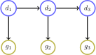
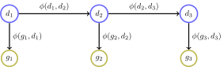
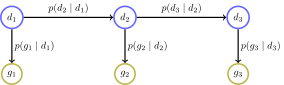
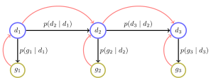
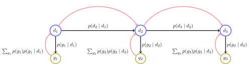
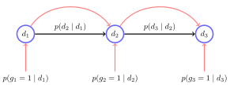
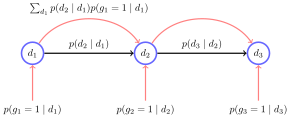
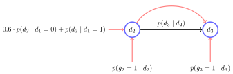
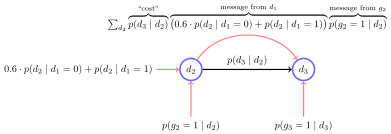
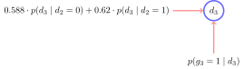

---
date: 2020-09-16T00:00:00.000Z
title: 'Belief Propagation'
author: 'Matthew Russell'
tags: ['probability', 'math']
---  
  
  
Let's say that you and I are roommates, and I notice you've been gone the last two Friday nights. This is not necessarily unusual, and sometimes your Friday night excursion is a date. However, you don't communicate well, so I have no idea if you had a date or not.
  
As you prepare to go out for the third Friday in a row, I wonder if *this* Friday you have a date. You won't spill the beans, but I have a mind-reading superpower &mdash; \*pause for dramatic effect\* &mdash; math :fire:.
  
I make an educated guess that if you had a date last week, there's a higher chance you'll have a date again this week that if you didn't. I also know that if you have a date, you'll definitely be gone on Friday night, while you're only gone sometimes if you don't have a date. 
  
I make a few notes:
$$
\begin{aligned}
p(\text{has date this week} \mid \text{had date last week}) &= 0.5 \\
p(\text{has date this week} \mid \text{no date last week}) &= 0.2 \\
p(\text{gone Friday} \mid \text{has date this week}) &= 1.0 \\
p(\text{gone Friday} \mid \text{no date this week}) &= 0.6
\end{aligned}
$$
  
  
(Note that I'm not super optimistic that you'll get a second date. Or that you'll get a date in the first place, for that matter. Hey, at least I think you are more likely than not to have Friday night plans. :man_shrugging:)
  
Then I write down my observations:

| Week | 1 | 2 | 3 |
|-|-|-|-|-|
Observation| Gone | Gone | Gone |
  
I decide to use $d_n \in \{ 0, 1 \}$ to denote whether you actually had a date on the $n$th week, and $g_n \in \{ 0, 1\}$ to denote whether you was gone on the Friday of the $n$th week. With this notation, I notice that I can write the probability of a certain sequence of date/no date and gone/not gone events as:

$$
p(d_1, d_2, d_3, d_4, g_1, g_2, g_3, g_4)
$$  
 
Note that this is a function. If I subsitute in values for the variables, I can calculate the probability of any combination of the states.

# How to be Sherlock Holmes

There's a few different things I could do as this point to deduce some interesting conclusions.

1. *Marginalize* the distribution to get rid of some variables and keeping others. For example, maybe I am just surprised you have been gone so much, so I'd like to find
$$
p(g_1, g_2, g_3)
$$
which could tell me the probability that you'd be gone certain weeks regardless of if you had a date or not. To find the probability that you'd be gone all three Fridays, I can just plug in $g_n = 1$ for all the values.

2. *Condition* the distribution to include some prior knowledge or evidence I know. For example, I could try to find
$$
p(d_1,d_2,d_3\mid g_1, g_2, g_3)
$$
which would let me figure out what the probability of any sequence of date/no date given my knowledge of you being gone. I could combine this with marginalization to get rid of $d_1$ and $d_2$, since I really only care whether you have a date this week regardless of whether you had dates the previous weeks.

$$
p(d_3 \mid g_1, g_2, g_3)
$$

3. *Find the value that maximizes the probability*. This is a subtle twist on the previous two. While calculating 
$$
p(d_3 \mid g_1, g_2, g_3)
$$
tells me the *chance* that you did or did not have a date, I could also calculate
$$
\underset{d_3}{\arg \max} \ p(d_3 \mid g_1, g_2, g_3)
$$
which would be the *value* of $d_3$ that maximizes that chance. So using argmax will tell me the most likely state of $d_3$&mdash;date or no date&mdash;instead of just the chance of each state individually. The difference is subtle, but often times we want the most likely $d_3$ and don't care too much about the actual probability value itself.

All these options are versions of *inference*. The game is afoot.

# Some Assumptions
Before I dive into making calculations, I want to get things straight in my mind, so I make two assumptions:
1. The chance you have a date this week is only dependent on whether you had a date the immediately preceding week (If you're taking notes, this is called a Markov assumption)
2. The chance you go out this Friday is only dependent on whether or not you have a date this week, not any of the previous weeks

With these in hand, I draw a nice little graph showing these dependencies.




Plus, we can rewrite what we know with these symbols to get

$$
\begin{aligned}
p(d_n = 1\mid d_{n-1} = 1) &= 0.5 \\
p(d_n = 1 \mid d_{n-1} = 0) &= 0.2 \\
p(g_n = 1 \mid d_n = 1) &= 1.0 \\
p(g_n = 1 \mid d_n = 0) &= 0.6
\end{aligned}
$$

Ah, that will make things easier to think about.

# Factor Functions and Conditional Probability Distributions
In the next couple of paragraphs, I'm going to explain my algorithm using an expression that looks like
$$
\phi(x, y)
$$
This is a function defined for each set of connected nodes and is analogous to the likelihood that both nodes have a particular value given the state of the other node. In that sense it is like a conditional distribution, but doesn't strictly have to be a distribution in the sense that a distribution always sums up to 1. This function is like a heuristic. The bigger $\phi(x,y)$ the more likely $x$ and $y$ will be in that particular state together. The smaller $\phi(x,y)$, the less likely $x$ and $y$ will be in that state together. Now back to the problem at hand.

# Belief Propagation

I can solve the inference problem to find $p(d_3 \mid g_1, g_2, g_3)$ using a message passing approach known as belief propagation. The basic idea of message passing is to start with the leaf nodes and pass information up until you reach the node you are interested in ($d_3$ in this case). At each step, you marginalize out (remove references to) any nodes below you in the tree. That means that at each node, the distribution of the node variable can be calculated purely as the product of all the messages passed in from its immediate children.

Each message is a little abstract though. It is not necessarily a single value, but more of a symbolic function that says, "Hey recepient, this function expresses my factor value as a function of only your value." That is, the message from node $x_i$ to $x_j$ could be written as $m_{i \to j}(x_j)$ and defined as

$$
m_{i \to j}(x_j) = \sum_{x_i} \phi(x_i, x_j) \prod_{k \in N(x_i)\setminus i} m_{k \to i}(x_i)
$$

In English, this says that for a given value of $x_j$, the message is the product of the joint factor of $x_i$ and the given $x_j$ value and all $x_i$'s incoming messages summed across all the possible values of the sender $x_i$. 

# A Graphical Solution

:neutral_face: Okay, maybe that wasn't helpful. Let's draw a picture! I'll start with our previous graph, but label the edges.



  
What are these factor values in my case? Since I am using a directed graph (Bayesian network) I can simply write them as the conditional probabilities that relate each node.
  



  
I want to end up at $d_3$, so I can draw a message passing tree with $d_3$ as the root.
  



  
I want to pass messages up this tree to the root. Think of each factor $p(\cdot)$ as a sort of "cost" to move up the tree. Each node will essentially take its value and send it up the tree, multiplying by the cost of sending it through the output edge, and summing across all its values to remove itself. Let's see how this works. Starting at the leaves, the node value is $p(g_n)$. The "cost" of sending a message to $d_n$ is $p(g_n \mid d_n)$, so the whole message is $m_{g_n \to d_n}(d_n) = \sum_{g_n} p(g_n \mid d_n) p(g_n)$.
  




Notice that $\sum_{g_n} p(g_n) p(g_n \mid d_n)$ can be simplified to $p(g_n = 1) p(g_n = 1 \mid d_n)$ since I know $p(g_n = 0) = 0$ (the chance you didn't go out on that Friday is 0, because I know you went out every Friday). Of course, the flip side of that is $p(g_n = 1) = 1$, and I simplify to get $p(g_n = 1 \mid d_n)$. I'll also cut down the graph a little so you can see how passing the messages marginalizes out and removes the leaf nodes as I go up the tree.




On to the next message! I need to start with the message from $d_1$ to $d_2$ since the other messages depend on it. Remember the message will be the node value times the "cost" summed over all the values of the node so it disappears from the graph. Thus I get
  




I can't make any assumptions about the value of $d_1$, so I have to sum over both possible values, 0 and 1. This ends up giving me

$$
p(d_2 \mid d_1 = 0)p(g_1 = 1 \mid d_1 = 0) + p(d_2 \mid d_1 = 1) p(g_1 = 1 \mid d_1 = 1)
$$

This is starting to get long . . . but wait! I actually know the values for some of these quantities! Based on the values defined many many equations ago I can simplify to 

$$
p(d_2 \mid d_1 = 0)\cdot 0.6 + p(d_2 \mid d_1 = 1) \cdot 1
$$

Adding this to the graph and noticing that $d_1$ disappears now, I get



  
Time to do it again! The next message becomes
  




The only "gotcha" here is that now the value of the $d_2$ node before multiplying by the "cost" is already the product of the *two* incoming messages to $d_2$, not just one incoming message like we had before. This message expands across the values of $d_2$ to be

$$
\begin{aligned}
p(d_3 \mid d_2 = 0) \times
\big(0.6\cdot p(d_2 = 0\mid d_1 = 0) &+ p(d_2 = 0 \mid d_1 = 1)\big)p(g_2 = 1 \mid d_2 = 0)\\ &+ \\
p(d_3 \mid d_2 = 1) \times
\big(0.6\cdot p(d_2 = 1\mid d_1 = 0) &+ p(d_2 = 1 \mid d_1 = 1)\big)p(g_2 = 1 \mid d_2 = 1)
\end{aligned}
$$

which is an absolute mess. But once again I can simplify using the probabilities I defined many moons ago.

$$
\begin{aligned}
&p(d_3 \mid d_2 = 0) 
\big(0.6\cdot 0.8 + 0.5 \big) \cdot 0.6 \\ &\qquad + \ 
p(d_3 \mid d_2 = 1)
\big(0.6\cdot 0.2 + 0.5\big)\cdot 1 \\ \qquad \qquad &= p(d_3 \mid d_2 = 0)(0.588) + p(d_3 \mid d_2 = 1)(0.62)
\end{aligned}
$$

Getting rid of old nodes again, I now have




The value of $d_3$ is simply given by the product of these messages

$$
\overbrace{\big(0.588 \cdot p(d_3 \mid d_2 = 0) + 0.62 \cdot p(d_3 \mid d_2 = 1)\big)}^{\text{message from }d_2}\overbrace{p(g_3 = 1 \mid d_3)}^{\text{message from }g_3}
$$

Since $d_3$ could be 0 or 1, I can write

$$
\begin{cases}
\big(0.588 \cdot p(d_3 = 0 \mid d_2 = 0) + 0.62 \cdot p(d_3 = 0 \mid d_2 = 1)\big) p(g_3 = 1 \mid d_3 = 0), & d_3 = 0 \\
\big(0.588 \cdot p(d_3 = 1 \mid d_2 = 0) + 0.62 \cdot p(d_3 = 1 \mid d_2 = 1)\big) p(g_3 = 1 \mid d_3 = 1), & d_3 = 1 \\
\end{cases}
$$

Plugging in my known values once more I find

$$
\begin{aligned}
\begin{cases}
(0.588 \cdot 0.8 + 0.62 \cdot 0.5 ) \cdot 0.6, & d_3 = 0 \\
(0.588 \cdot 0.2 + 0.62 \cdot 0.5 ) \cdot 1, & d_3 = 1 \\
\end{cases} \\
\implies \begin{cases}
0.468, & d_3 = 0 \\
0.428, & d_3 = 1 \\
\end{cases}
\end{aligned}
$$

This is not a probability distribution, since the values don't add up to one. Thus, I normalize it and find

$$
p(d_3) = \begin{cases}
0.522, & d_3 = 0 \\
0.478, & d_3 = 1 \\
\end{cases}
$$

Note that because I incorporated my prior knowledge about $g_n$ into the math, I can correctly call this $p(d_3 \mid g_1 = 1, g_2 = 1, g_3 = 1)$. The answer to my question is that since you've been gone three Friday nights in a row, there's a 47.8% chance that this week your evening out was a date.

# Epilogue
After all this discussion, a natural question you might ask would be, "Matthew, wow, this is so cool! Can you figure out anything about whether or not *you* have a date this Friday?" Yes, actually, and that is much simpler. It should be pretty clear by now that if I have spent *my* Friday night doing probability math and belief propagation, the chance that I have a date is exactly 0% :neutral_face:. Mathematically, this is

$$
p\left(\text{has date} \mid \begin{matrix}\text{spent all of Friday night}\\\text{doing probability calculations} \\ \text{about his roommate} \end{matrix}\right) = 0
$$

:smirk:

# Some Code
Here's the code to solve the exact problem. I'd like to generalize this more so you can ask more questions and easily change the base assumptions.
```python {cmd=true}
def check_chance(
    has_date: bool, 
    consec_weeks_gone: int
):
    """Recursively calculate the chance that this week
    is a date given the # of consecutive weeks gone.

    Args:
        has_date (bool): Check for date or no date chance
        consec_weeks_gone (int): The number of consecutive weeks
            gone on a Friday
    """
    if consec_weeks_gone == 1:
        # base case
        if not has_date:
            return 0.6
        else:
            return 1.0
    else:
        if not has_date:
            return (0.8 * check_chance(
                has_date=False, consec_weeks_gone=consec_weeks_gone-1
            ) + 0.5 * check_chance(
                has_date=True, consec_weeks_gone=consec_weeks_gone-1
            ))*0.6
        else:
            return (0.2 * check_chance(
                has_date=False, consec_weeks_gone=consec_weeks_gone-1
            ) + 0.5 * check_chance(
                has_date=True, consec_weeks_gone=consec_weeks_gone-1
            )) * 1.0

# have to check both cases since we don't
# normalize until the very end
has_date = check_chance(has_date=True, consec_weeks_gone=3)
no_date = check_chance(has_date=False, consec_weeks_gone=3)
total = has_date + no_date
p_date = [
    no_date / total,
    has_date / total
]
print(f"p(has date) = {p_date[1]:.3f}")
print(f"p(no date) = {p_date[0]:.3f}")
```

```
p(has date) = 0.477
p(no date) = 0.523
```

  