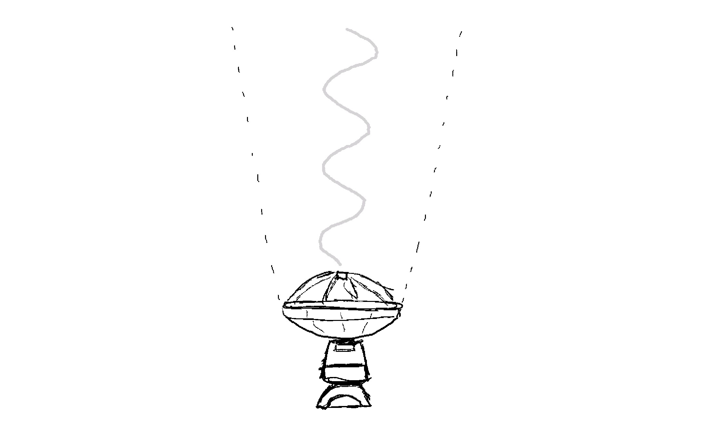
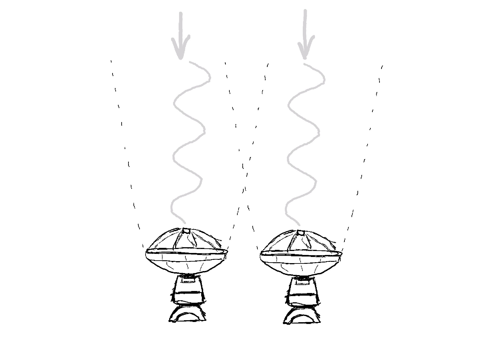
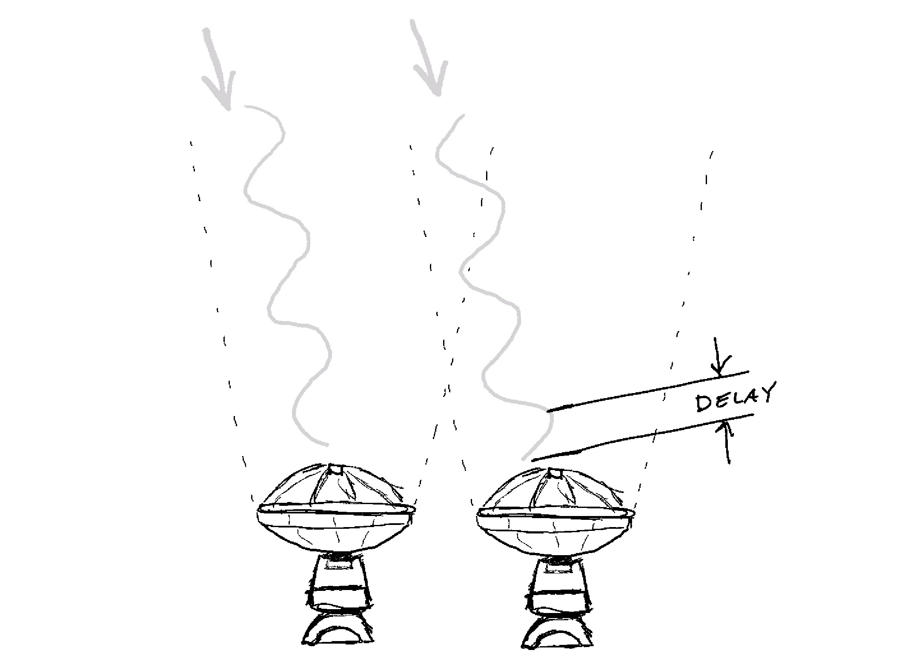
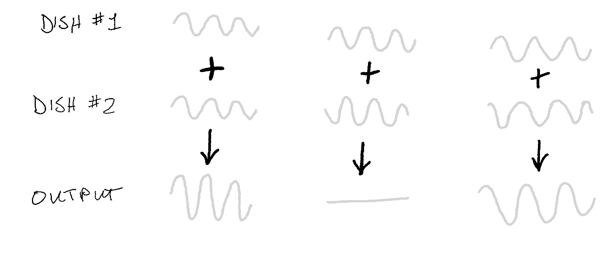
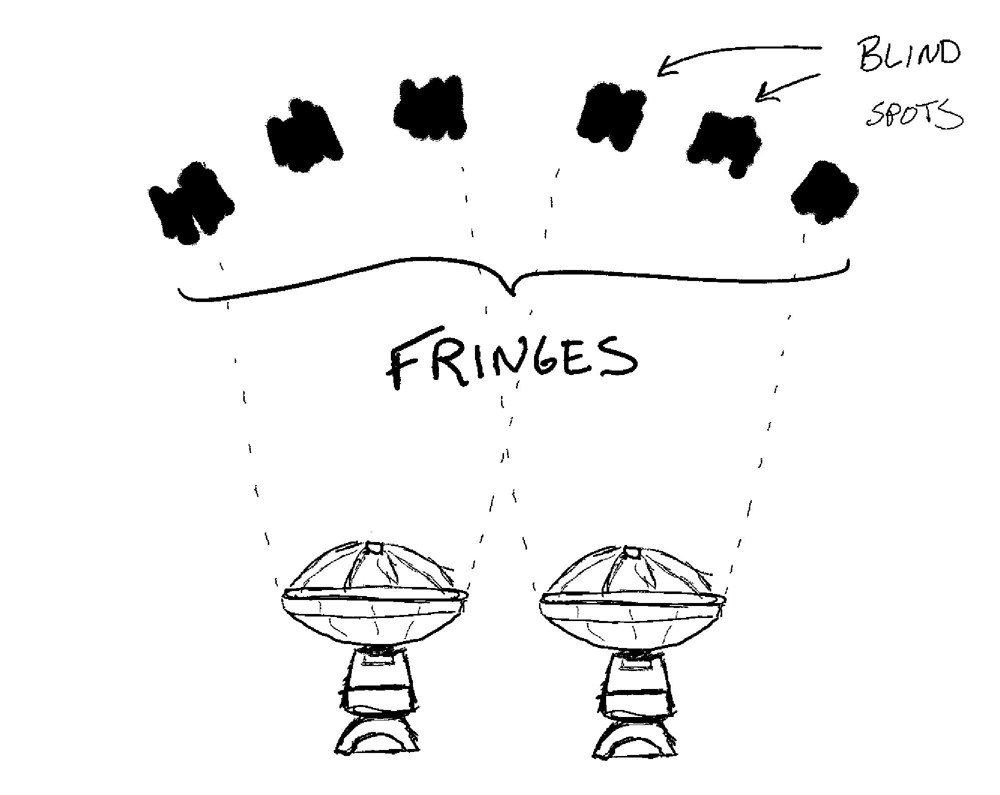
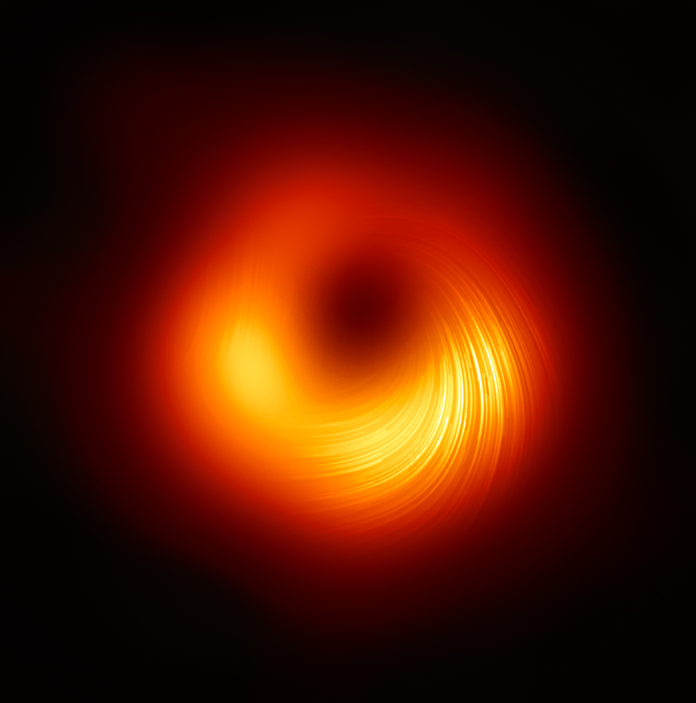

Radio telescopes fascinate me. When someone explains how they work, you can't help but think: "Wait, you can actually do that?" On one hand, the mathematical theory behind them simply exudes elegance, yet the implementation challenges seem impossible overcome in practice. We are clearly dealing with some absurdities when typical solutions involve maser atomic clocks and keeping equipment at temperatures less than a handful of degrees above absolute zero, which, if you had forgotten, is the temperature at which atoms don't even vibrate.

First of all, radio telescopes are *big*. Absolutely huge. It would take you nearly two minutes to walk across the diameter of the dish of the [Large Millimeter Telescope (LMT)](https://en.wikipedia.org/wiki/Large_Millimeter_Telescope) in Mexico, which is over 16 stories high. And that is only a third the height of the [Green Bank Telescope (GBT)](https://en.wikipedia.org/wiki/Green_Bank_Telescope), whose dish *wider than a football field.* If you dropped a baseball from the top, it would free fall for well over five seconds before it hit the ground, which may not sound like a long time, but think of dropping that ball, counting five solid mississippis, and it *still* hasn't hit the ground yet. Not all telescopes are this massive, but big telescopes are nice because they give you better resolution. Many things practically limit how big we can actually make a dish, with the GBT pushing the upper limits. 

If you can't go bigger, the obvious alternative is to build a bunch of smaller of telescopes. This gives us two benefits. First, that's a lot more dishes that can collect the tiny amounts of light coming from ridiculously far distances away from Earth. Plus, if we play our cards right, we can make each of those dishes act like a piece of one bigger dish. It's not perfect, since it's like having a dish that's mostly empty with just a few spots filled in, but it can dramatically increase the telescope's resolution. And since the surface of the earth rotates with respect to the sky, each dish actually traces out a curve rather than just a single point on the dish of the bigger, "virtual telescope," resulting in a technique known as Earth Aperture Synthesis.

Getting arrays of multiple telescopes to work together requires radio interferometry. Light coming from directly above the telescopes reaches all the dishes at the same time, so all the dishes "see" the same signal. Light coming from slightly off-vertical directions hits the dishes with different delays. If you add up all the signals, sometimes the light waves will reinforce each other, but other times they will cancel each other out. Whether they cancel each out depends on the direction the from which the light is coming.

The combined telescope can only "see" where the light waves reinforce each other, so it ends up with blind spots. Since light waves are cyclical, so are the blind spots, creating a "fringe" or striped pattern of sensitivity across the sky. Blind spots are actually good, since we really only want to see things in the direction we are pointing rather than having signals bleed in from other angles. 

With enough dishes at the right distances from either other, we can stack their signals such that the combined telescope is most sensitive to signals coming from a tiny focused beam instead of the very wide angular view of each individual dish.	

However, if we want to make a picture, we have to move this tiny beam around to measure different "pixels," but *we can't move the telescopes in tiny enough increments to do this.* Remember how the light coming from different directions reaches each dish with a slightly different delay or offset? Given a particular point in the sky, we can calculate what this delay will be for each dish. Then we can add an artificial delay so the light from this point reaches the telescope computers *at the same time* instead of out of sync. Instead of cancelling each other out, the light now adds up, making the telescope sensitive to this new direction. And just like before, the different signal offsets at each dish--now produced by the artificial delay--causes the beam to zero itself out in all other directions, effectively making the telescope point in this new direction without needing to move the physical dishes at all.

And now things get really weird. We can move the telescope beam around *after the data has already been collected.* Let me say that again. We can point the tiny beam in different directions by carefully delaying and adding up the individual dish signals without needing to do this during the observation itself. Think of just two dishes to understand how this works. We point them straight up and record all the data at the same time. If we add the two signals without delaying either of them, the telescope's virtual beam points straight up. That gives us a signal we can turn into the middle pixel of our image. If we delay the left dish signal slightly, it simulates the light taking longer to reach the left dish, mean that the beam is pointed slightly to the right. If we add the signals together now, we get something we can turn into our right pixel. By swapping the delay onto the right dish's signal, we can add them up again to get our left pixel.

But wait, you might say, how is this possible? Wasn't the beam only pointed in a single direction when we collected the data? Where does this "extra" information come from that we can turn into the off-center pixels? The key piece here is that while the *combined* beam is only pointed in a single direction controlled by the signal delays, each dish itself is still receiving light from a much wider field of view. The beam only shrinks when we add up the signals. All the information exists in the original signals, but it's all mixed together. With multiple signals (or perspectives), we can sort out what pieces came from what parts of the sky to create our radio telescope image.

This isn't as foreign a concept as you might think. In fact, your brain does this highly complex delay and correlation process in real time with the sounds that reach your ears. Think of recording an orchestra in stereo with two microphones. Each mic hears all the instruments. If you listen to the recording with headphones, your brain is smart enough to pick up on the tiny differences in volume of each instrument at each ear to identify which direction the sounds are coming from. With just two signals, you can build a mental image of where all the instruments are located--violins on left and cellos on the right, etc.--without actually needing to be at the concert. Radio telescopes do the same thing, but with more "ears" and with distant radio signals instead of sounds.

Modern radio telescope arrays are insane Rube Goldberg machines. Incredibly complex receivers listen for vanishing faint signals masked not only by other much strong radio sources, but also by the thermal noise of the materials that make up the telescope and receiver. With telescopes thousands of miles apart synchronized by atomic clocks (and a little luck), astronomers can build observatories the size of Earth itself, like the Event Horizon Telescope (EHT). Point this massive telescope in the right direction, and you can see some *very* interesting things . . . 

If somehow you've never heard of black holes before, let me remind you what's going on here. The gravitational pull of the black hole is so strong that light cannot escape it, and light from behind the hole is warped around the black shadow. Furthermore, somewhere buried deep in this shadow is a cosmic "divide by zero" error. Divide by zero on a calculator, and it will throw up its hands and give up. Divide by zero in the universe, and . . . well, no one knows for sure. It's as if spacetime doesn't exist at that point, like someone pricked a tiny hole in the fabric of the universe. 

## More Information

- [Radio telescope](https://en.wikipedia.org/wiki/Radio_telescope) (Wikipedia)
- https://eventhorizontelescope.org/
- [What are Radio Telescopes?](https://public.nrao.edu/telescopes/radio-telescopes/) (National Radio Astronomy Observatory, NRAO)
- [Low Frequency Radio Astronomy](http://www.ncra.tifr.res.in/ncra/gmrt/gmrt-users/low-frequency-radio-astronomy) (not for the faint of heart)
- *Einstein's Shadow* (Seth Fletcher)