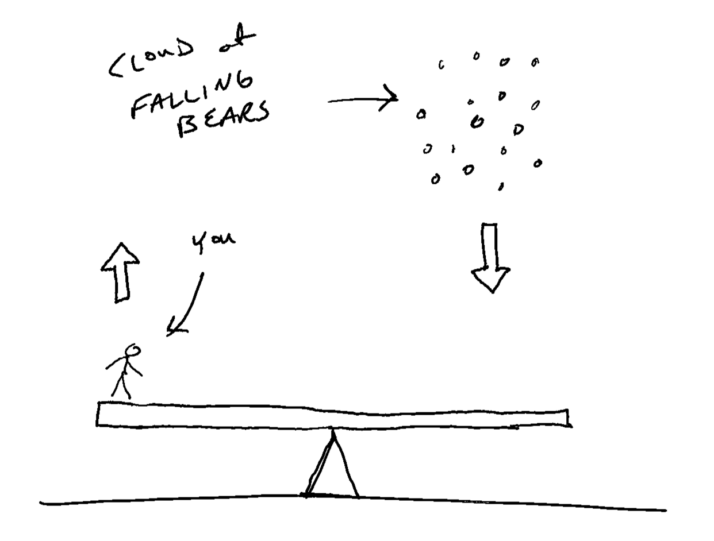
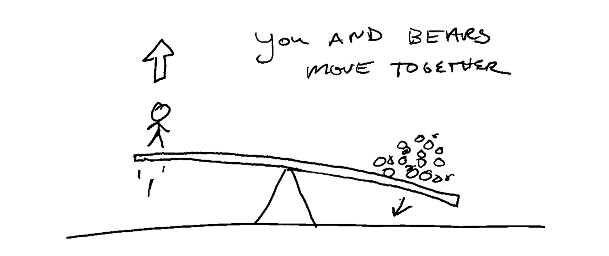

You want to go to space, but you want to do it your way. None of this rocket stuff. That's already been done. No, you need an original way to hurl yourself into the sky. Obviously, your first thought is a seesaw. Those are made for just this sort of thing.

You'll sit on one side. You'll drop something heavy on the other side. One thing will lead to another, and whammo, you'll find yourself waving to the astronauts inside the space station in no time. Of course, you need to pick something to drop, so you pick bears. They seem like they'd be on board for this kinda thing. But how many bears. And how high should you drop them from. Fortunately, this is the whole reason math exists.

It all starts with what happens when the bears hit the seesaw. There are two extremes. 

On one hand, the bears could hit the seesaw and perfectly transfer all of their energy through the seesaw to you&mdash;an "inelastic collision" since no energy is lost to heat by elastically deforming you or the bears. This is like when pool balls hit; one stops and the other takes all the energy. In this case, the seesaw would flex to absorb all the energy of the bears, and then rebound like a diving board to throw you up in the air. Since all the energy in the bears is conserved, the more bears or higher the drop height, the faster you will launch. 

The first step is figuring out how much energy you need:
$$
E_\text{orbit} = \underbrace{m_\text{you} gh_\text{orbit}}_{\substack{\text{energy to get you}\\\text{you high enough}}} + \underbrace{\frac 1 2 m_\text{you}v_\text{orbit}^2}_{\substack{\text{energy to get you}\\\text{you fast enough}}}
$$
Assuming you are about 155 lbs (70 kg) and you need to go 17,500 mph (7,800 m/s) at 275 miles (440,000 m) high, we get $E_\text{orbit}$ = 2.4 billion Joules (gigajoules, GJ). Since the bears don't lose any energy, they need to start with this much to transfer it to you:
$$
E_\text{bears} = \underbrace{m_\text{bears}gh_\text{drop}}_{\substack{\text{energy because bears}\\\text{are really high}}} = 2.4 \text{ GJ}
$$
Of course, we have to drop them from somewhere, so the obvious choice is the Empire State Building, which is about 440 m tall. We know that each bear is about 450 kg, so $m_\text{bears} = 450n$ for $n$ bears. Working all that into the last equation with correct units gives us:
$$
\begin{aligned}
n &= \frac{(2.4 \times 10^9 \text{ kg}\cdot\text{m}^2/\text{s}^{2})}{(9.8 \text{ m/s}^2)(440 \text{ m})(450 \text{ kg})} \\
&\approx 1300 \text{ bears}
\end{aligned}
$$
We round up because nobody wants a fractional bear involved. We don't need anyone getting hurt here.

The other extreme is that the seesaw bends just enough to slow down the bears and accelerate you until you are both moving at the same speed. This is an elastic collision because the bears (and you) deform on collision and energy is lost, especially when the bears ride the seesaw into the ground and lose energy via the resulting noise and, uh, ... Anyway, in this case, energy isn't conserved, but momentum is. Increasing the number of bears doesn't always help, because once they hit the seesaw, that's more mass in the combined :man_astronaut: + seesaw + :bear: system, meaning it doesn't have to move as fast to still conserve all the momentum.

We still need you to end up with 2.4 GJ of energy, but now the bears need to start with more than that because they lose some of it when they put the smack down on the seesaw. Let's work backwards. Even though the 2.4 GJ represents the energy for being high and going fast, when you lift off you will be nearly ground level, so all that energy needs to be contained in making you go fast. How fast, though?
$$
\frac 1 2 m_\text{you} v_\text{launch}^2 = E_\text{orbit} = 2.4 \text{ GJ}
$$
Assuming you are 70 kg (because that's what we used to get the 2.4 GJ number), we get $v_\text{launch} = 8300 \text{ m/s}$. That' s roughly 19,000 mph. Momentum is conserved, so we know that the momentum at launch (when you and the bears are moving on the seesaw together) much match the momentum of the bears just before they hit the seesaw:
$$
(m_\text{you} + m_\text{bears})v_\text{launch} = m_\text{bears}v_\text{impact}
$$
At impact, all the bears' energy will be involved in making them go fast. So we know that the energy they started with from being high ($m_\text{bears}gh_\text{drop}$) is now all being used to make them go fast ($\frac 1 2 m_\text{bears} v_\text{impact}^2$). Equating the two, we get
$$
\begin{aligned}
m_\text{bears}gh_\text{drop} &= \frac 1 2 m_\text{bears} v_\text{impact}^2 \\
\implies v_\text{impact} &= \sqrt{2gh_\text{drop}}
\end{aligned}
$$
Let's go back to the momentum equation and put in what we know:
$$
\begin{aligned}
(m_\text{you} + m_\text{bears})v_\text{launch} &= m_\text{bears}\sqrt{2gh_\text{drop}} \\
\implies h_\text{drop} &= \frac{\left(\frac{m_\text{you} + m_\text{bears}}{m_\text{bears}}\right)^2v_\text{launch}^2}{2g} \\
&= \left(\frac{m_\text{you} + m_\text{bears}}{m_\text{bears}}\right)^2 \times \frac{v_\text{launch}^2}{2g}
\end{aligned}
$$
We can do a quick plot of this:

That's fascinating. Because adding more bears increases the mass in the collision, the required drop height doesn't change much by the time we get to 30+ bears. That height is about 3600 km or 2200 miles. 

Of course, the real collision will be somewhere between perfectly elastic and perfectly inelastic. However, with a few assumptions (no air resistance, no friction, willing bears, a strong enough seesaw, and good lawyers) we can say that a bear-powered seesaw space launch would require between 30 and 1300 bears dropped from between 0.25 and 2200 miles.

