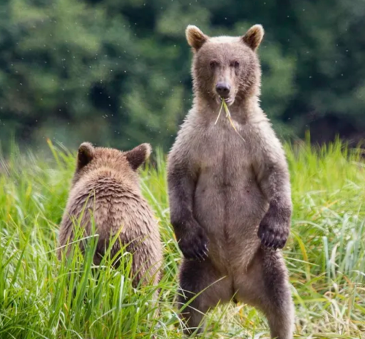
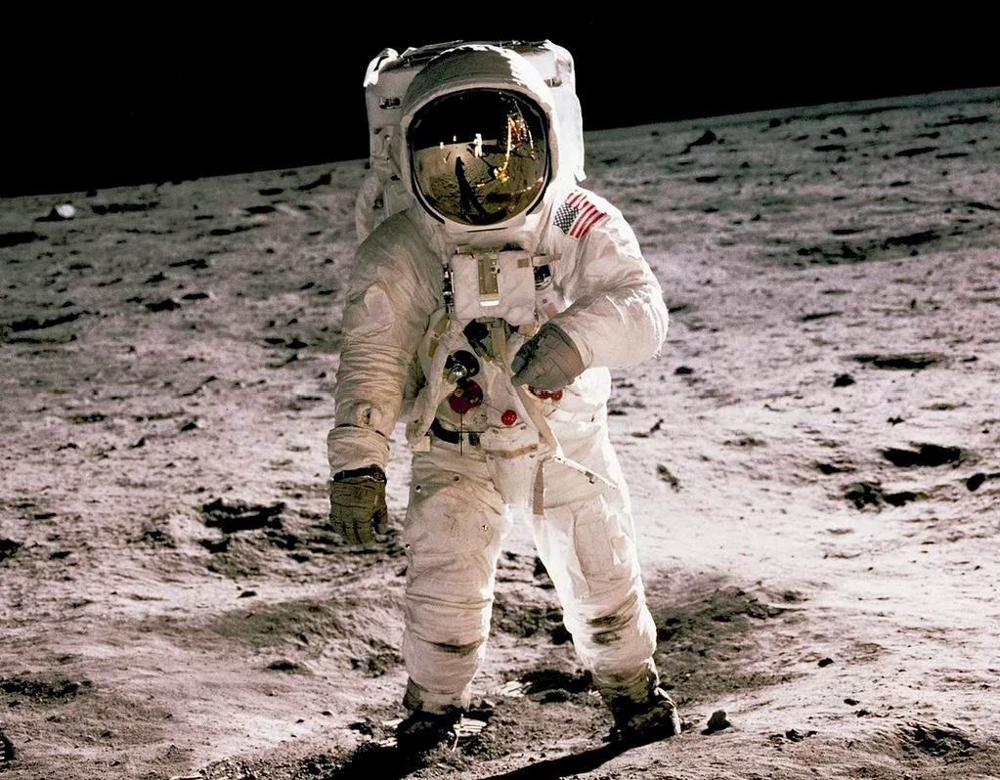
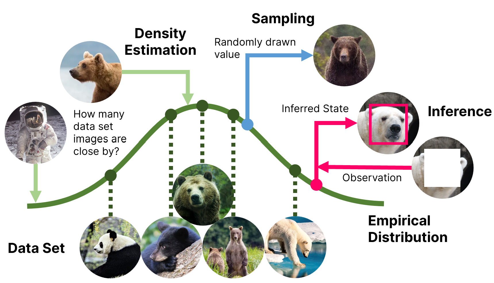

How would you explain whether an image contains a bear?
Maybe you'd point out the ears, the snout, or the color of the fur.
But how would you come up with a *number* that quantitatively
describes the "bearyness" of the image?

To the ~~batmobile~~ math-mobile![^1]

A "probability distribution" describes data associated with an *uncertain process*.
The probability of heads and tails describes the uncertain process of flipping a coin.
We *distribute* the total probability&mdash;which must add up to 100%[^2]&mdash;between the two possible outcomes.
The distribution can also describe the relationship between inputs and outputs.
For example,
we could describe the process of a leaf falling to the ground
with a distribution of starting heights and corresponding landing locations.

These "processes" don't have to be real&mdash;they just have to be useful.
We can imagine that there is a fictional “bear process”
that produces images of bears.
The probability distribution would describe
the complex relationship between all the individual pixels
that makes them a bears versus anything else.
This doesn't exactly mirror a process in nature,
but it *is* useful for modeling the "bearness" of an image.[^3]

For simple, theoretical distributions, like that of a coin flip,
we can write a precise mathematical expression for the probability of every possible outcome.
However, for complex problems like figuring out how to gauge the "bearness" of
every possible set of pixel values, this is impossible.

Instead we rely on the "empirical distribution,"
which is a collection of observations produced
by the uncertain process we are studying.
When we observe this data about the process,
we are observing "samples" from the corresponding probability distribution.
Importantly, we never observe the true distribution&mdash;we only see it
implicitly as it appears in the data we collect.
The more data we have, the better we can approximate the true distribution.

Modeling a probability distribution from observed samples lets us ask questions about the distribution or process.
For example, we might ask, "How densely packed are bear images around this test image?"
If the bear images are dense at this point, the test image probably contains a bear.
If the bear images are sparse, the test image is probably not a bear. This is called "density estimation."

In some cases, we might ask, “What other data could we expect from the underlying process?” We might want to generate more examples of ~~where a leaf could land~~ bear images. This is called "sampling."[^4]

Finally, we might ask, “Given a partial or incomplete observation, what do we expect to fill in the blanks?”
We could have a bear image that is missing pixels and want to find the likely values of those pixels to “fix” the picture.
We might have information about where a leaf landed and want to find likely starting heights given those landing locations.
Inversely, we might have information about the starting height and want to find likely landing points. This is called *inference*.

Here's a neat little picture (with bears) to explain density estimation, sampling, and inference:

Thinking about things in terms of probability distributions ~~makes you a nerd~~ gives you the tools
to understand the world around you in new and powerful ways.
If you can describe a process or data in terms of probability distributions (called "modeling"),
you can leverage all the associated math to pose and answer complex questions&mdash;like "is this a bear."

[^1]: Don't worry, I'm sure it's just as cool or cooler than the batmobile.

[^2]: Forcing the total probability to add up to 100% is just a formal way of saying that *something* has to happen all of the time. We can't say that a coin flip will be heads 40% of the time and tails 40% of the time, but nothing happens the remaining 20% of the time. That makes no sense.

[^3]: I suppose whether you think this is useful is a matter of personal conviction.

[^4]: You may have heard about "generative AI" or "generative models" that can do this fake data generation.
