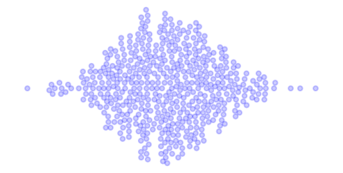
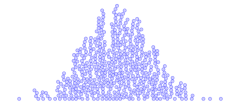
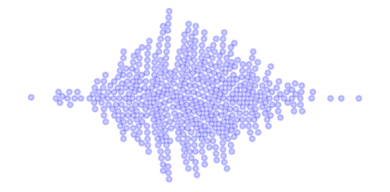

With one-dimensional data, sometimes you want a plot that visualizes density. Histograms require binning the data, which lowers the resolution and hides the actual data points. A kernel density plot might be better but also hides the data points. A swarmplot or stripplot fixes this by packing the data points as circles. Where the data points are closer together, they stack up farther away from the axis, giving us a visualization of the density.

But how do we actually calculate the offsets for each data point so the visualization shows nicely packed circles? We need to find the minimum offset that doesn’t overlap with the points packed so far. A brute force approach might look like:

1. Initialize all offsets to zero
2. For each value:
   1. Generate a set of candidate offsets
   2. Calculate the distance between each candidate point (value, offset) for this value and the previous points
   3. Find the offsets that produced distances > 2 * circle radius from all previous points
   4. Pick the minimum remaining offset

A Python implementation might look like:

```python
def get_swarm_xy(x: np.ndarray, radius: float) -> Tuple[np.ndarray, np.ndarray]:
    y = np.zeros_like(x)
    for i in range(len(x) - 1):
        new_y = np.linspace(-5, 5, 1000)
        new_y = np.array(sorted(new_y, key=lambda x: np.abs(x)))
        dist = np.sqrt(
            (x[i + 1].reshape(-1, 1) - x[: i + 1].reshape(1, -1)) ** 2
            + (new_y.reshape(-1, 1) - y[: i + 1].reshape(1, -1)) ** 2
        )
        idx = np.argmax(np.all(dist > 2 * radius, axis=-1))
        y[i + 1] = new_y[idx]
    return x, y
```

- Note that we sort the candidate `new_y` array by the absolute value. Later, we pick the first item in `new_y` that avoids overlap. Sorting by absolute value ensures that we pick the smallest *magnitude* offset on either side of the axis.
- After calculating the distance between all the points, we look for rows where all distances are greater than twice the radius of the circles we’ll plot, avoiding overlap. These rows correspond to the candidate offsets we started with (sorted by magnitude), so we next find the minimum row index where all distances avoided overlap.
- Finally, we grab the selected offset by indexing the candidate array with the index we found.

Obviously, this algorithm as a big downside. We try all possible offsets to find the best one. A better approach would be to analytically solve for the smallest offset given the previous points as constraints. In addition, it doesn’t find the globally optimum pack, just optimal given the points packed so far. However, it’s a straightforward implementation that isn’t bad for small data sets, like these 500 normally distributed values:

```python
data = np.random.randn(500)
marker_radius = 0.05
x, y = get_swarm_xy(np.sort(data), marker_radius)
fig, ax = plt.subplots(figsize=(4, 4), dpi=150)
ax.set_xlim(-4, 4)
ax.set_ylim(-4, 4)
for x_, y_ in zip(x, y):
    ax.add_patch(
        matplotlib.patches.Circle((x_, y_), marker_radius, color="blue", alpha=0.2)
    )
ax.axis("equal")
ax.axis("off")
plt.show()
```




Of course, we can tweak our function to generate different variations. Here we use only positive offsets:



Or we can sort the values first:



With this approach, creating nicely packed swarmplots can quickly improve the quality of 1D data visualizations.