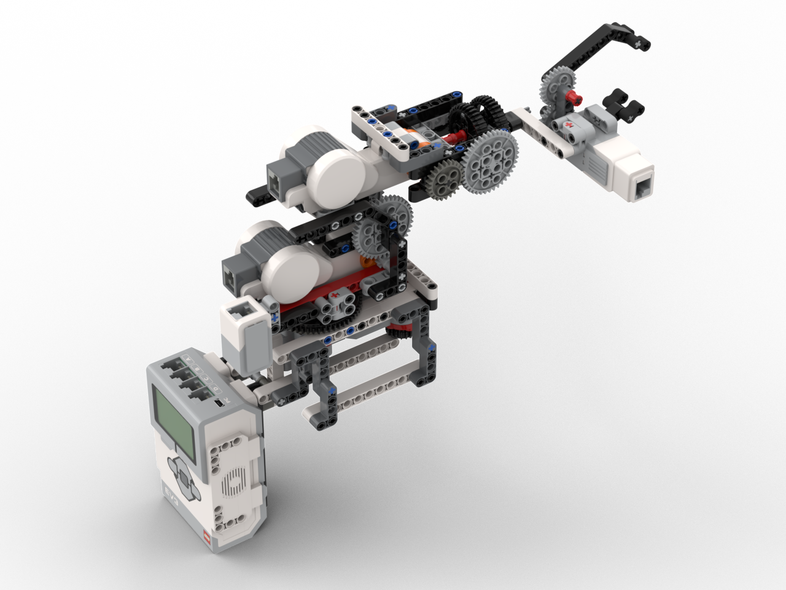
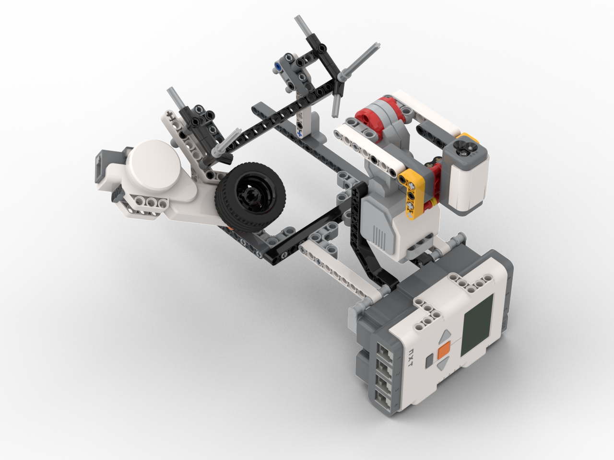
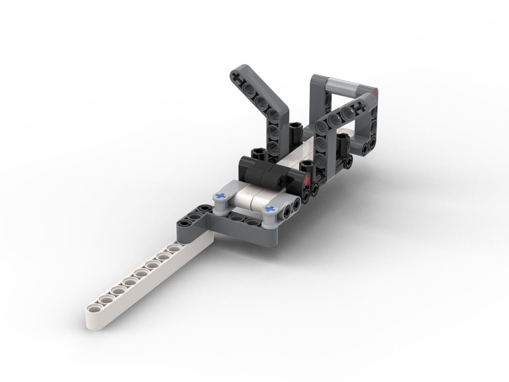

Hackster recently (read: September) [announced](https://www.hackster.io/contests/alexa-lego-voice-challenge?source=hacksterhomepagehttps://www.hackster.io/contests/alexa-lego-voice-challenge?source=hacksterhomepage) a LEGO MINDSTORMS EV3 and Alexa challenge. I've had quite a bit of experience with the NXT kit (unfortunately, all before I had any online presence), know Python and Node.js pretty well, and am comfortable with embedded Linux development via the Raspberry Pi, so I thought, hey why not give it a shot?

Here's the result:

<iframe width="560" height="315" src="https://www.youtube.com/embed/4Rc6c5YwXTE" frameborder="0" allow="accelerometer; autoplay; encrypted-media; gyroscope; picture-in-picture" allowfullscreen></iframe>

Basically, its a voice-controlled laboratory that can create and innoculate agar plates. My concept was a microgravity laboratory that astronauts could easily interact with without needing tons of training or constant contact with mission control. Check out the [full project on Hackster](https://www.hackster.io/mbr4477/albert-lab-0fcf07) and the [code on GitHub](https://github.com/mbr4477/albert).

Also, through this project, I discovered the super cool [Studio](https://www.bricklink.com/v3/studio/download.page) CAD software for LEGOs. These photorealistic renderings are pretty awesome.

