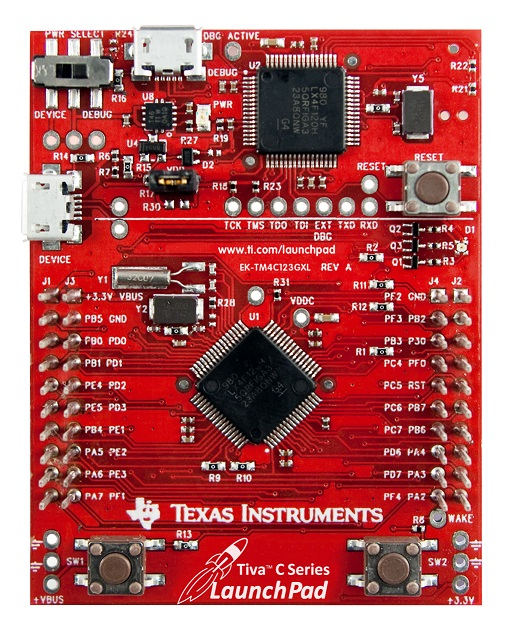
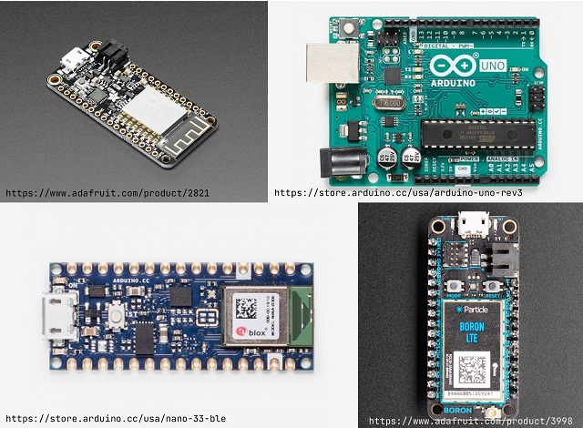
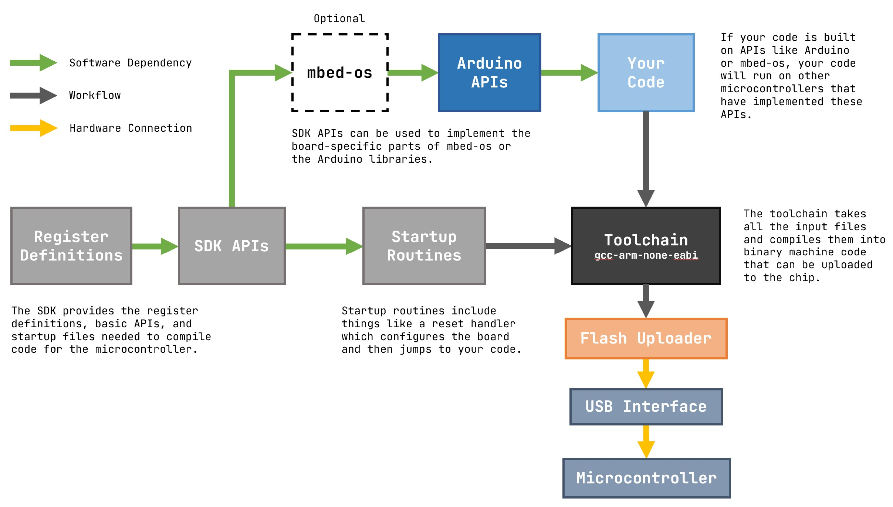

The world of embedded hardware and firmware is confusing.

>  If you're already confused, "firmware" just means "software that runs very close to the hardware." And "very close to the hardware" means that you have no operating system to work with. The code you run is the only code there is. Nothing's magic, and that's important to remember, probably in general.

I'd guess the culprit is the variation among manufacturers which becomes accentuated with embedded platforms since you are working so close to the hardware. So everything's a mess, basically. What I want to do is walk step by step up the layers of abstraction so you have a context for how everything is related embedded hardware systems (If you aren't familiar, embedded systems are things like Arduinos or Raspberry Pis). Let's dive into it and head back to where it all starts.

# Sand

Okay, this is probably too far back. But sand makes silicon, and silicon makes computer chips. Let's fast forward in the process just a bit.

# Microcontrollers

A microcontroller is an entire computer on a chip. By "computer," I mean "has all the pieces of a computer," since in most cases it is absurd to even think of running Windows or macOS on these things. That will become apparent in a minute. In any event, these chips have all the core components --- a CPU, RAM (working memory), Flash storage (long term memory), and inputs and outputs. Those input/outputs (I/Os) could be single digital pins that can be turned on or off, sets of digital pins that work together as a communications bus, or special pins that can read analog voltages or simulate analog outputs by quickly flicking the pin on and off. Most of these I/O pins are referred to as General Purpose Input Output or GPIO. The communication buses could be things like Inter-Integrated Circuit (I2C), Serial Peripheral Interface (SPI), and Universal Asynchronous Receiver Transmitter (UART) ports. All these components are put on a single chip, and the necessary connections are made accessible via somewhere between 8 and 100+ tiny pins. The black chip in the middle of the red board below is the [TM4C123GH6PM](https://www.ti.com/product/TM4C123GH6PM#:~:text=The%20TM4C123GH6PM%20microcontroller%20is%20targeted,control%2C%20transportation%2C%20and%20fire%20and) microcontroller from Texas Instruments. With a whopping 256 kilobytes of Flash memory (your computer probably has 256 or more *gigabytes*, roughly a million times more), 32 kilobytes of RAM (your computer likely has 250,000 times that), and 80 MHz clock speed (your computer is likely 25 times faster), I hope it now makes sense that these tiny chips can't run macOS. But they are surprisingly handy for lots of things that require low power consumption and small footprints.



*A microcontroller development board from Texas Instruments that uses the T4MC123GH6PM microcontroller (image from [here](https://processors.wiki.ti.com/index.php/Getting_Started_with_the_TIVA%E2%84%A2_C_Series_TM4C123G_LaunchPad)).*

One very very important takeaway from the hardware level is that *everything on this chip is controlled using registers*. A "register" is essentially a special place in memory. Each register has an address, which might look like 0x1523AB59 in hexadecimal and represents the location of a single 32-bit (4-byte) integer. Some registers are control registers. Writing certain numbers or bits to these registers will configure the board's settings, like setting up an output port or telling the CPU to run at a certain speed. Other registers are used to read data, like the value of an input pin or the last byte of received data from a UART. To sum up, you can get this chip to do anything you want just by moving data in and out of these special memory-like locations called registers.

# Development Boards

The natural question might be "do I have to work with all those tiny pins or can I used something like that red board in the previous picture to make it easier" and the answer is yes, you will usually want a *development board*. These are very handy for a few reasons:

1. **They already have the basic circuits you need to make the thing turn on.** This is surprisingly difficult. You need connectors, power regulators, capacitors, resistors, crystals, etc. The data sheet for the chip explains what all these things do, but without a degree in electrical engineering, you might want to skip that step.
2. **They make the pins bigger.** This is probably obvious, but it makes the chip more "human-sized" to attach other components to.
3. **You get a USB port.** This is a surprise tool that will help us later. Hint: How would connect that chip to a computer to download your program?

Some development boards include Adafruit's Feather footprint which has boards for [ESP32 chips](https://www.adafruit.com/product/2821) with WiFi and Bluetooth, the [Arduino Nano 33 BLE](https://store.arduino.cc/usa/nano-33-ble) which has Bluetooth and uses the same microcontroller as the [Particle Boron LTE](https://www.adafruit.com/product/3998) (the nRF52840), and the ever popular [Arduino Uno](https://store.arduino.cc/usa/arduino-uno-rev3) based on the ATmega328P. Some work at 5 volts, others at 3.3 volts, and most have USB ports. 



When starting a project, the big things to think about are:

- How small do I need the board to be?
- How much RAM/Flash do I need? Will I be working with images or cameras which require more memory or just simple LEDs?
- Are my sensors or displays compatible with the same 5V or 3.3V level of the board?
- Do I need WiFi? Bluetooth?
- Do I want/need to solder any connectors myself?

Once you have a microcontroller and supporting hardware, the next step is to get some code running on it.

# Firmware, Kind Of

Whenever you write a computer program, it is ultimately translated into machine code, which is just ones and zeros. Immediately above this (in the layers of abstraction) is *assembly code* which uses mnemonic labels as a human-readable (sort of) one-to-one correspondence with the binary machine code. Chip makers stick to predefined standards for what machine code instructions their chips support. The most popular flavors for embedded systems are arguably ARM and RISC, and *toolchains* are software tools that you can use to compile assembly language into these instruction sets and download it ("flash" it) to the board. Some of these toolchains are open source like `gcc-arm-none-eabi` which is designed to use the open source compiler GCC (`gcc`) for ARM machine code (`arm`) without any operating system (`none`) while targeting an embedded application binary interface (`eabi`). 

In any event, assembly language is great because to convert from Celsius to Fahrenheit all you have to do is

```assembly
LDR R1,#9
LDR R2,#5
MUL R1,R0,R1
DIV R1,R1,R2
ADD R0,R1,#32
```

which is actually pretty terrible so let's get away from that as quickly as possible. Luckily most toolchains also support C and C++ which allows us instead to write

```c
uint32_t convert_temp(uint32_t celsius)
{
    return 9 * celsius / 5 + 32;
}
```

which is much better. Unfortunately, there is still a problem. Even though the toolchain could convert our code into machine code that would theoretically run on the board, in reality it won't.

# Software Development Kits (SDKs)

There are a couple things we need to deal with:

1. **How do we tell the chip to run our code when it boots?**
2. **How do we use those registers from earlier to do things?**

Most chip makers provide a software development kit (SDK) and microcontroller datasheet to help with these things. The answer to (1) is to have special assembly code that defines something called a "reset handler" that does the setup and configuration when the board turns on and then hands over control to your application code. For (2), although we could read through the data sheet to find the addresses we need, the SDK helps out by giving us, at a minimum, a bunch of premade register definitions. For example:

```c
// this is the register definition from the SDK
#define GPIO_PORTA ((void*) 0x160000B0)

// turn on a GPIO pin in our program by storing a value in the register
GPIO_PORTA |= 0x04;
```

Better yet, many times the SDK gives us pre-built functions to simplify things, so we can stick to code like

```c
gpio_port_a_set_pin(3); // "3" is the pin we want to turn on
```

The SDK provides a library of functions and definitions to make it much easier to write code for the microcontroller. At this point, we have enough help that we can write code with the necessary startup procedures, compile it with a toolchain, and download it to the board. Which is all great, but what if we want to reuse code? If I want to use someone else's code that communicates over I2C with an LCD display or a temperature sensor, will it work? The short answer is no. You won't be able to use any code that doesn't target your exact microcontroller (or development board). Each chip uses different register addresses, has different ports, and needs different startup code, so unless you luck into someone working with the same chip, you'll most likely be out of luck.

# APIs To The Rescue

To solve this problem, we can define an *application programming interface* that specifies what the SDK functions should be named, what arguments they should accept, and what values they should return. For example, let's say there is a `digital-gpio` API out there that defines two function signatures:

```c
void digital_write(uint8_t pin_number, uint8_t value);
void digital_read(uint8_t pin_number);
```

Notice that the API doesn't define how these functions work. The trick here is that *every chip provides its own implementation.* So maybe in our imaginary example, the implementation for our microcontroller is

```c
void digital_write(uint8_t pin_number, uint8_t value)
{
    if (value)
    {
        gpio_port_a_set(pin_number);
    }
    else
    {
        gpio_port_a_reset(pin_nubmer);
    }
}
```

while for some other board the implementation looks like

```c
void digital_write(uint8_t pin_number, uint8_t value)
{
    T2MD_SET_PIN(pin_number, value);
}
```

We don't have to worry about the implementation. If we write our code to work with the generic `digital-gpio` API, then as long as our chip manufacturer (or someone else) has provided an implementation of the API for our board, we can write code with the `digital_write` function, and it works. Even better, this code works on any other chip that has an implementation of the `digital-gpio` API, so our code is portable. Now we can write a library that simplifies using an I2C sensor and can be used on more than one microcontroller, because it only depends on higher-level APIs that are not microcontroller-specific.

# Arduino

At this point we can finally talk about Arduino. Arduino is essentially a set of APIs like what I explained in the previous section. What makes Arduino special is that it has gained quite a following and has a lot of momentum behind it. Thus, if you write your code using the Arduino APIs, chances are that a ton of people and boards will be able to use it. If you create a new microcontroller and want to support the Arduino API, you need to provide certain implementations of low-level functions, but then the Arduino API takes over and developers can use any sensor library or other library built for Arduino with your board.

> Arduino is more than just APIs, though. It also includes a bootloader on the chip that can receive compiled code from the Arduino IDE and all the utilities and toolchain nicely packaged together to give a (relatively) smooth experience.

Now it's possible that the Arduino library doesn't directly interact with the board SDK like we've been assuming. There could be another layer in between! For example, maybe someone has already implemented an API for your board, but it's not *quite* what you wanted. You could start over from the board SDK or you could leverage the intermediate API to make your job easier. That's exactly what the Arduino people did with [some of the new BLE boards](https://blog.arduino.cc/2019/07/31/why-we-chose-to-build-the-arduino-nano-33-ble-core-on-mbed-os/). Specifically, the Nordic nRF52840 didn't have an Arduino API implementation, but it *did* have an [mbed OS](https://os.mbed.com/mbed-os/) implementation, which also came with a lot of useful Bluetooth LE protocol code that could be reused. Rather than having to rewrite everything from "scratch" (the board SDK), they could build a fairly easy wrapper around the mbed OS APIs to make the chip meet the Arduino API requirements. Plus, now if any other boards support mbed OS, they could very easily support Arduino as well using this mbed OS implementation of the Arduino Core.

# An Architecture Diagram

To sum up everything, check out this diagram that shows how all the pieces fit together. Luckily, to build something cool, you don't need to understand how to do each piece yourself, but with this context you can know what you do and don't need to pay attention to when working on your project. If your board already has Arduino support, you can probably find a library to talk to that SPI display you have. If not, you might need to write your own by looking at what the equivalent Arduino library does and rewriting it using your board SDK. The embedded landscape can be a little confusing at first, but mastering even a small portion of it can be like gaining a superpower.



*(Header image from [Particle](https://store.particle.io/collections/gen-3/products/argon-kit))*
