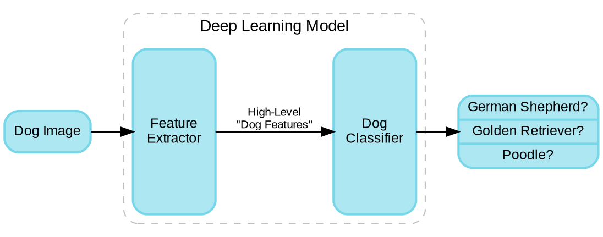
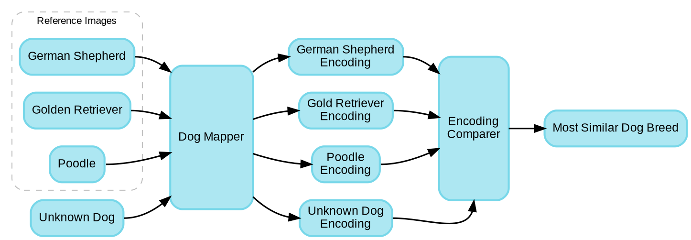
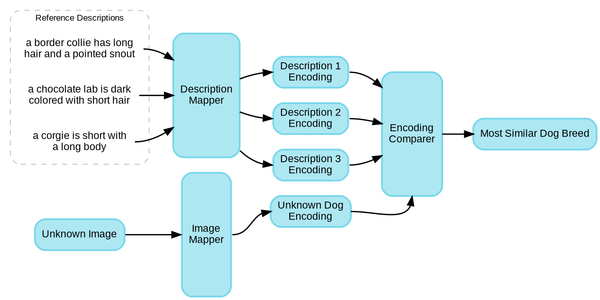

Photo by <a href="https://unsplash.com/@alinnnaaaa?utm_source=unsplash&amp;utm_medium=referral&amp;utm_content=creditCopyText">Alina Grubnyak</a> on <a href="/s/photos/network-tangled?utm_source=unsplash&amp;utm_medium=referral&amp;utm_content=creditCopyText">Unsplash</a>

In today's world, *artificial intelligence* is often used to refer to machine learning. It's a bit of a misnomer since most people think of AI as self-aware or able to teach itself. In reality, researchers have discovered optimization processes that can extract patterns from volumes of data and the correlations between those patterns and whatever end result we are looking for (such as figuring out what is in an image).

Deep learning has gotten very good at this type of problem. By stacking several layers of functions one after the other, deep models can iteratively extract higher and higher level features from the input data. For examples, early layers might find lines and edges in images, later layers might compose these into shapes, and final layers might put shapes together to form ears, guitars, or other objects. However, deep networks are usually heavily restricted by the input data they have seen. If we train a network to identify three different dog breeds, it will probably do pretty well. But if we feed it a picture of a completely new breed, it will still classify it as one of the three it knows about--even though the breed is clearly different. It only knows what it has seen before during training.

<em>A typical deep learning model for classifying an image as one of three different dog breeds.</em>

This is a pretty basic example. In reality, we have *plenty* of dog pictures that we could've used during training. But it is pretty common to run into scenarios where the training data we would normally need is simply not practically available. Maybe we want to identify an endangered species with only a handful of images. Maybe we have a description of the animal, but no pictures at all. Maybe it would simply take too much time or money to collect the data we would like. Maybe we are looking for the same end result, like transcribing speech to text, but we need to work well with new voices that were never heard at training time. All these situations fall in the category of transfer learning.

# Transfer Learning
In a slight oversimplification, there are two types of transfer learning. Either you train a model for one task, and then apply it to another task, or you train a model with one set of data, but need to apply it on different data. In the first case, we want to switch up the target task, while in the second case we want to switch up the input data domain.

How we go about doing this comes in many flavors, dependent on how much training data you have, whether that data is labeled with the correct answers or not, and what similarities might exist between the training and application situations. For a more in depth introduction, check out the key paper by Pan & Yang, [*A survey on transfer learning*](https://www.cse.ust.hk/~qyang/Docs/2009/tkde_transfer_learning.pdf). Here, I want to focus on some specific situations.

# Few-Shot and One-Shot Learning
As I alluded to in the introduction, we may well find ourselves in a scenario where the data we need is not available in the typical quantities required for deep learning. To solve this, we flip the traditional deep learning strategy a bit. Normally, we would train our model to positively identify the things we are looking for (see the first deep learning diagram above). It learns what features of a dog make it a German Shepherd instead of a poodle or retriever, and it only learns the features that are useful for picking between these three breeds. When it sees enough of those German Shepherd features in an image, it flags the image as a German Shepherd.

Few-shot and one-shot learning take a different approach. Instead of looking for German Shepherd features, we look for features that help us differentiate between all the dog examples we've seen so far. We specifically train the model to look for differences and similarities instead of explicit breeds. The network learns that ear shape and fur texture are good ways to differentiate between all three dog breeds we have pictures of. Instead of training the model to tell us that the dog is of a particular breed, we train it to map the dog image into an encoding (read: a bunch of decimal numbers) that are a good approximation of all these key "dog features" that show up in the image. Dogs with similar features will end up with very similar encodings, while different breeds will end up with clearly different encodings.

At this stage, you may think we've missed the point a bit. Haven't we gone from identifying the dog breed to creating a cryptic encoding of the dog's features? Well, yes. But it turns out that is extremely powerful. Let's now say that you give me just one picture each of three new dog breeds the network has never seen before. Without needing any retraining, the model can quickly spit out the encodings of the dog features in each reference image. Now if I need to identify a dog as one of these new breeds, I can just feed the unknown image through the model and pick the breed whose reference image had the most similar encoding.

<em>Mapping images to dog encodings to find the most likely breed.</em>

Why is this better than just comparing the images directly to see which reference image is most like the unknown image? Whenever we do that, we have to make a somewhat arbitrary decision about how exactly to compare the images. Do we calculate the difference between corresponding pixels? Do we look for lines and edges first and compare those? By training the network with pictures of dogs, even if we will never actually see those dogs when we use the network, we help the model figure out what features can be used to differentiate between dog breeds. We make the assumption that these features will be effective at distinguishing between new breeds, too.

I'd also like to point out that we still need a ton of training data so the model can figure out what those important dog features are. However, we don't need pictures of every single dog breed now to do a decent job matching new images with a few reference breeds. Plus, we can swap out those reference breed images on the fly without needing to retrain. We discovered a way to use the data we *did* have to train a model that would transfer to data we *didn't* have.

One-shot and few-shot learning are pretty similar, just with different numbers of reference examples. However, what if we don't have any reference examples at all?

# Zero-Shot Learning
Spoiler alert: that isn't quite true. More accurately, what if we don't have any reference examples that are *of the same type* of the input data? Maybe we have a bunch of dog descriptions, but no pictures of the dog breeds we want to use as references. Well, like with few-shot and one-shot learning, the solution isn't magic. Now we just train our model to find the correlations between the descriptions of dogs we *do* have lots of images of. In this way we teach the network to map the dog's image *and* description to similar encodings. Thus, when we are given new dog descriptions, we can use them to generate reference encodings that we can compare with the encodings from unknown images. Suddenly, we can identify pictures of dogs just by a textual description of them.

<em>Using only descriptions of breeds with zero images to identify an unknown dog image.</em>

Like before, we didn't eliminate the need for lots of training data, we just reworked the problem so we could use data we *do* have to build a network that generalize well to data we *don't* have.

# Conclusion
Deep learning is powerful, but not magic. Many of the impressive applications are just the result of clever twists on the task and data. Although identifying a never-before-seen example might seem impossible, few-shot, one-shot, and zero-shot learning show that with the right problem formulation, we can make models that do pretty well. For more in-depth information about these strategies, check out these resources:
- Vinyals et al., [Matching Networks for One Shot Learning](https://arxiv.org/pdf/1606.04080.pdf) (2017)
- Snell, Swersky, & Zemel, [Prototypical Networks for Few-shot Learning](https://arxiv.org/pdf/1703.05175.pdf) (2017)
- Koch, Zemel, & Salakhutdinov, [Siamese Neural Networks for One-shot Image Recognition](https://www.cs.cmu.edu/~rsalakhu/papers/oneshot1.pdf) (2015)
