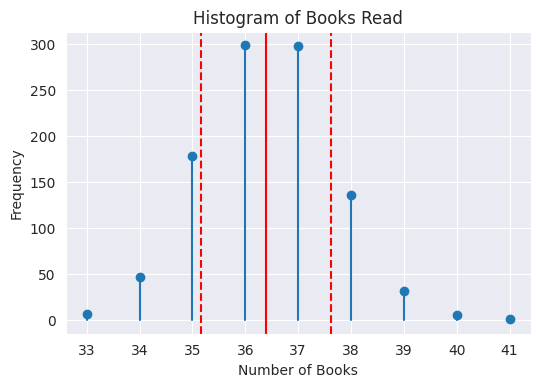
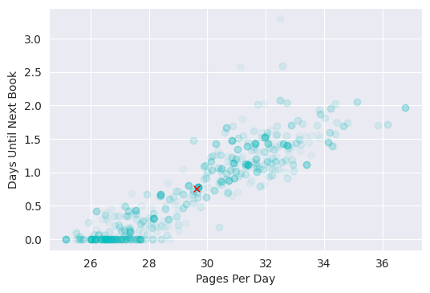
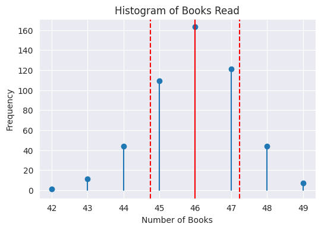

After my previous post on simulating how many books I will read this year, I naturally asked myself, "Well, if 30 pages per day and taking 3 days to find another book to read won't cut it, how fast *should* I read and how fast *should* I find new books if I want to meet my Goodreads goal?" Undoubtedly, you have also lost sleep over this question, wondering if there is any hope left for my literary aspirations. No longer. Welcome to the exciting conclusion of *Matthew, Monte Carlo, and the Unrealistic Reading Goal*.

Before we tackle that question, I'll review the Monte Carlo simulation setup with new (and slightly) improved code since I want this post to be an end-to-end practical walk-through of Monte Carlo simulation that you can use to solve your own real-world problems. To jumpstart you, I've put all the code from this post on [Google Colab](https://colab.research.google.com/drive/1NHZSNM8dDj4UTFk1zepvukKuwsnhWr9t?usp=sharing). Grab my email over on my about page and show me what you come up with!

# Setting Up the Code

In this example, we'll be using PyTorch for its probability distributions, but you can use NumPy exclusively if you prefer.


```python
import torch
import torch.distributions as dist
import numpy as np
from tqdm import tqdm
```

The `tqdm` package is useful for progress bars. I like the styling that Seaborn provides, so we'll use it and Matplotlib for creating figures.


```python
import matplotlib.pyplot as plt
import seaborn as sns

sns.set_style("darkgrid")
```

# How Many Books Will I Read in 2021?

Recall that I would like to estimate how many books I will read this year. Unfortunately, this could be complex to figure out analytically because of the factors involved. For this example, I'll stick to three assumptions:
- I read books between 150 and 350 pages long
- I read 30 $\pm$ 10 pages per day
- It takes me 0 to 3 days to find another book to read

I'll start by coding a function that simulates 365 days. The basic algorithm is:
1. Initialize books read to 0
2. While days elapsed is less than 365:
    1. Randomly sample a book length from the book length distribution
    2. While the number of pages left is more than zero:
        1. Randomly sample a number of pages I read on a given day
        2. Subtract these pages from those left in the book
        3. Increment the number of days elapsed by 1
    3. Increment the number of books read by 1
    3. Randomly sample a number of days before I find another book to read
    4. Add that number to the elapsed days
3. Return the number of books read

The important part of this simulation is that all the quantities are random variables. We don't know for sure what they will be, which is why Monte Carlo simulation is so powerful. It allows us to understand how the uncertainties in these inputs will impact the variation in the output. Here's how the sim looks in code:


```python
def books_read_in_year(reading_speed, book_delay):
    """
    Args:
        reading_speed (int): The mean number of pages read per day
        book_delay (int): The mean number of days between books
    """
    days = 0
    num_read = 0

    # avoid an infinite loop
    if reading_speed == 0:
        return dict(num_read=0)

    book_length_dist = dist.Uniform(150, 250)
    # use a Gamma distribution so this never goes below 0
    book_delay_dist = dist.Gamma(book_delay, 1)
    page_dist = dist.Gamma(reading_speed, 1)

    while days < 365:
        book_length = book_length_dist.sample()
        while book_length > 0:
            book_length -= page_dist.sample()
            days += 1
        days += book_delay_dist.sample()
        num_read += 1
    return dict(num_read=num_read)
```

That's all it takes to write a simulation! Let's see how many books I can expect to read. Because each simulation run samples values randomly, we need to run many simulations to get a good picture of the output.


```python
num_sims = 1000
outputs = torch.zeros(num_sims)
for n in tqdm(range(num_sims)):
    outputs[n] = books_read_in_year(reading_speed=30, book_delay=3)["num_read"]
```

    100%|██████████| 1000/1000 [00:32<00:00, 30.62it/s]


A quick histogram of the results will show us the distribution. I'll also plot the expected value (mean) and standard deviation.


```python
buckets, counts = torch.unique(outputs, return_counts=True)
mean = outputs.mean().item()
std = outputs.std().item()

plt.figure(dpi=100)
plt.stem(buckets.numpy(), counts.numpy(), basefmt='none')
plt.axvline(x=mean, c='r')
plt.axvline(x=mean+std, c='r', ls='--')
plt.axvline(x=mean-std, c='r', ls='--')
plt.xlabel('Number of Books')
plt.ylabel('Frequency')
plt.title("Histogram of Books Read")
plt.show()
```


​    



    


Thus, I will most likely read 36$\pm$1 books this year.

# How Can I Meet My Reading Goal?

This matches my previous post's results, but remember--my reading goal is 46 books this year. A more useful result would be the find the inverse relationship. Can I use my simulation to find out what my reading speed *should* be and how quickly I *should* find another book? Yes! Markov chain Monte Carlo will help us. 

In a nutshell, MCMC picks a possible value for the reading speed and book delay, runs a simulation with those parameters, and then picks a new set of parameters based on the result. The idea is that we can "walk around" the distribution of possible parameter values guided by how well the parameter guesses ("samples") help me meet my goal. We guide the walk by posing a new step and accepting it if the new parameters give us a better result. If the result is worse, we might still accept the sample, but only sometimes, based on how much worse it is. At the end, we will have a cloud of these samples that is denser where parameter combinations gave outputs which met my goal. 

The math works out that these sampled parameters will form the exact parameter distribution that yields my desired outcome. Parameters from the less dense areas still meet my goal, but not as frequently as those from the denser areas. This will make more sense when we look at the graph.

The first step is to create a function that runs a simulation and evaluates how good the number of books read is based on my target goal of 46 books.


```python
def evaluate(sample, target):
    """Run a simulation and return a quality score."""
    num_read = books_read_in_year(**sample)["num_read"]
    sigma = 1
    return np.exp(-((num_read - target) ** 2) / (2 * sigma))
```

I am using a pseudo-Gaussian function centered at my goal to compute the "goodness" of a simulation:
$$
q = \exp\left(-\frac{n-n_{\text{goal}}}{2\sigma}\right)
$$
We will use the Metropolis-Hastings flavor of MCMC because it is easy to implement. Other variations of MCMC are faster or produce better samples, but they can get complex very quickly. Just so you recognize the names, popular variants are NUTS (No U-Turn Sampler) and HMC (Hamiltonian Monte Carlo).


```python
def metropolis_hastings(iters):
    """
    Args:
        iters (int): The number of MCMC iterations to run.
    """
    # set up the target and initial parameters
    target_read = 46
    sample = dict(reading_speed=30, book_delay=3)
    step_sizes = dict(reading_speed=1, book_delay=0.5)

    # evaluate the first sample
    last_prob = evaluate(sample, target_read)

    samples = []
    for i in tqdm(range(iters)):
        # create a candidate new sample by randomly taking a step
        # starting from the current sample
        possible_new = {
            k: max(0, v + dist.Normal(0, 1).sample() * step_sizes[k])
            for k, v in sample.items()
        }
        
        # evaluate how good the new sample is
        posterior_prob = evaluate(possible_new, target_read)

        # we accept 100% of samples when the new score is 
        # larger than the old score
        p_accept = min(1, posterior_prob / last_prob)

        # pick a random number to conditionally accept the new sample
        if dist.Uniform(0, 1).sample() < p_accept:
            # save the sample
            samples.append(possible_new)
            # the new sample becomes the current one
            sample = possible_new
            # the new score becomes the old score
            last_prob = posterior_prob
        else:
            # the new sample was rejected, so save the old one again
            samples.append(sample)

    return samples
```

Kristiadi's [excellent blog post](https://wiseodd.github.io/techblog/2015/10/17/metropolis-hastings/) was a very concise, helpful resource when writing this code. Let's run our algorithm for 1000 iterations and check the results.


```python
samples = metropolis_hastings(1000)
```

    100%|██████████| 1000/1000 [00:42<00:00, 23.44it/s]


Calculating some quick summary statistics tells us the expected value of each parameter based on the samples:


```python
reading_speed = torch.tensor([s["reading_speed"] for s in samples])
book_delay = torch.tensor([s["book_delay"] for s in samples])
expected_speed = torch.mean(reading_speed)
expected_delay = torch.mean(book_delay)
print(f"E[reading_speed] = {expected_speed:0.1f}")
print(f"E[book_delay] = {expected_delay:0.1f}")
```

    E[reading_speed] = 29.6
    E[book_delay] = 0.8


If we plot the samples directly, we can see how they cluster together. I'll plot them as partially transparent, so we can get a feel for the density. Darker regions mean those parameter values are more likely to result in simulation outputs that meet my goal.


```python
plt.figure(dpi=100)
plt.scatter(reading_speed, book_delay, color="c", alpha=0.05)
plt.plot(expected_speed, expected_delay, "rx")
plt.xlabel("Pages Per Day")
plt.ylabel("Days Until Next Book")
plt.show()
```



    


Notice that the output follows our expectations. As the book delay increases, the pages I read per day must also increase to ensure I still meet the goal.

We can validate the results by feeding the expected parameter values back to the simulation to see if they really do produce outputs that meet my goal.


```python
num_sims = 500
outputs = torch.zeros(num_sims)
for i in tqdm(range(num_sims)):
    outputs[i] = books_read_in_year(expected_speed, expected_delay)["num_read"]
```

    100%|██████████| 500/500 [00:20<00:00, 24.31it/s]

Just like before, we'll plot the distribution of results as a histogram.

```python
buckets, counts = torch.unique(outputs, return_counts=True)
mean = outputs.mean().item()
std = outputs.std().item()

plt.figure(dpi=100)
plt.stem(buckets.numpy(), counts.numpy(), basefmt='none')
plt.axvline(x=mean, c='r')
plt.axvline(x=mean+std, c='r', ls='--')
plt.axvline(x=mean-std, c='r', ls='--')
plt.xlabel('Number of Books')
plt.ylabel('Frequency')
plt.title("Histogram of Books Read")
plt.show()
```


​    



    

Yes! We do get an expected output of almost exactly 46 books, although it is coincidental that the expected value lines up so closely in this case.

So it turns out that if I read on average $29.6 \approx 30$ pages per day and only wait  $0.8 \approx 1$ day between books, I have a good chance of meeting my goal! Remember, my original guess was that I read about 30 pages per day, so the results tell me that I don't need to read *faster*, I just need to make sure I always have a next book lined up to start reading!