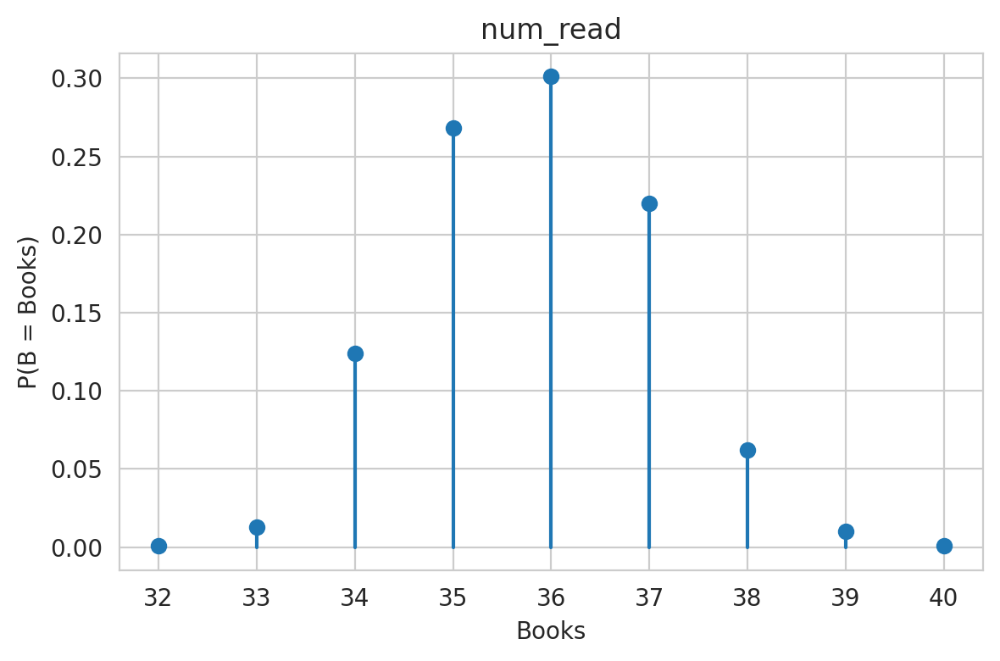

Monte Carlo simulations are super cool. As the name implies, these simulations are based on randomness, and if designed carefully, they can provide informative answers to questions that would be extraordinarily difficult—or impossible, intractable—to otherwise solve. 

## A Minimal Working (Coffee) Example 

I flip a coin. If it lands heads, I have the option of buying you coffee or flipping again. If the next flip is heads, I have to buy you two coffees. If the next is tails, I don’t buy you anything. I’m fairly conservative, but depending on my mood, I may be more or less inclined to take a risk. For example, if I owe you two coffees or less, I’ll probably flip again. I’ll cut my losses at 8 coffees. In between 2 and 8 however, my willingness to flip again is uniformly between 0.4 and 0.8. What is the expected number of coffees that I have to buy you?

You could probably solve this analytically and work out the theoretical probabilities, but it would be annoying. Alternatively, you could set up this simulation:

1. Pick random value between 0.4 and 0.8 to represent my riskiness
2. Initialize the coffee count to 0.
3. Flip a coin. If tails, stop the simulation.
4. If heads:
   1. Increment the coffee count
   2. If the count <= 2, go to 3
   3. If the count >= 8, stop the simulation
   4. Otherwise, randomly pick to continue flipping with probability given by my riskiness
5. Return the number of coffees

If I run this once, the result isn’t very meaningful. But if I run it 1000 times and average the number of coffees, we can estimate the outcome.

However, is the answer, the correct answer? We don’t know. The best this can do is tell us the true answer *if the model (i.e., the simulated decision making) accurately represents reality*. If the model is wrong, the output will not match the real world. This effect dominates in real-world scenarios.

## How to Win the World Series

Consider a given pitcher has a 80% probability of getting an out. With a little more information, I could do simulations to figure out how many games he will win. I’m willing to say that the vast majority of baseball simulators will figure this out by randomly determining the outcome of each at bat according to the 80% probability value.[^1] In fact, I would not be surprised if the numerical models used by the 2020 Tampa Bay Rays fell in this category (if they used simulations at all). 

We could do thousands of simulations and be pretty confident that if we (Kevin Cash, manager of the Rays) take out Blake Snell with one out in the sixth inning, the Rays will win more than they lose. However, this only means we have high confidence in *what the model indicates*, but does not speak at all to the quality of the model itself. If the model doesn’t account for important factors, the result could be “highly confident” around the wrong outcome. This is a classic example of accuracy (model realistically represents the real world) vs. precision (same outcome in lots of simulations).

Clearly if I'm raising this point, I believe the model was faulty. I do. Specifically, I believe the Rays failed to treat pitching performance as an autoregressive process.[^2] Simply put, Snell's performance against successive batters is not independent. Pitching in baseball is very "streaky"--strike out three straight batters and your are *more* likely to strike out the fourth because you are have "great stuff" this outing. This does not change the global expected outcome, but it does increase the variance, meaning that Snell will have a wider spread of good and bad performances. But the positive feedback nature of the process means that if Snell has a better than average start to the game, he has a good shot at better than average outcome to the game. Since Snell already had nine strikeouts through five and a third innings, he had achieved that better than average start.

Somewhat ironically, sabermetrics (baseball analytics) has received signifcant blowback because it ignores the human element of the game--the "eye test." However, as I've sketched, if you *correctly* implement the model, you can account for the human element--or at least the variation associated with it.

## How Many Books Will I Read In 2021?
I'll give a final example (with results!) to show how to can answer all sorts of questions with a Monte Carlo simulation--how many books can I expect to finish in 2021, and how much variance is there in the result? To do this, we can model the relevant factors as random variables, with $B$ as the R.V. representing the number of books I read this year.

Here's the basic facts:

- I read about 30 pages a day, $\pm$ 10
- I read books between 150 and 350 pages long
- It takes between 0 and 3 days for me to find a new book to read

Next, I'll pick distributions to model these as random variables:[^3]
$$
\begin{aligned}
P &\sim \text{Gamma}\left(k=90, \theta=\frac 1 3\right) \\
L &= \min (350, \max( 150, L_0)), L_0 \sim \text{Normal}(250, 50) \\
D &\sim \text{Uniform}(0,3)
\end{aligned}
$$

We can write a Python function to simulate one year of reading by sampling from these distributions until 365 days have passed:

```python
import torch
import torch.distributions as dist

def books_read_in_year():
  days = 0
  num_read = 0
  while days < 365:
    book_length = dist.Normal(250, 50).sample()
    book_length = int(max(150, min(350, book_length)))
    page_dist = dist.Gamma(90, 3)
    while book_length > 0:
      pages_read = page_dist.sample()
      book_length -= pages_read
      days += 1
    time_until_next_book = int(dist.Uniform(0, 4).sample())
    days += time_until_next_book
    num_read += 1
  return dict(num_read=num_read)
```

Run that 1000 times and we can plot the histogram of results:



We can thus conclude that *if the model is accurate*, the most likely outcome is 36 books. More precisely, the expected value is 35.8 $\pm$ 1.2 books. This is bad news--my 2021 reading goal is 46 books. Keep an eye on my Goodreads profile as the saga unfolds in the coming months.

Take some time to play around with Monte Carlo if you can. Use it to model project completion times, car repairs, career paths, your favorite sports team, presidential elections, and nuclear fission.[^4]

[^1]: https://tht.fangraphs.com/10-lessons-i-learned-from-creating-a-baseball-simulator/
[^2]: For more information about how AR processes pose a danger to Monte Carlo techniques see "Misadventures in Monte Carlo" (https://content.iospress.com/articles/journal-of-sports-analytics/jsa220)
[^3]: https://en.wikipedia.org/wiki/Gamma_distribution
[^4]: Monte Carlo was developed to simulate neutron fission in the Manhattan project (https://www.jstor.org/stable/2280232).
