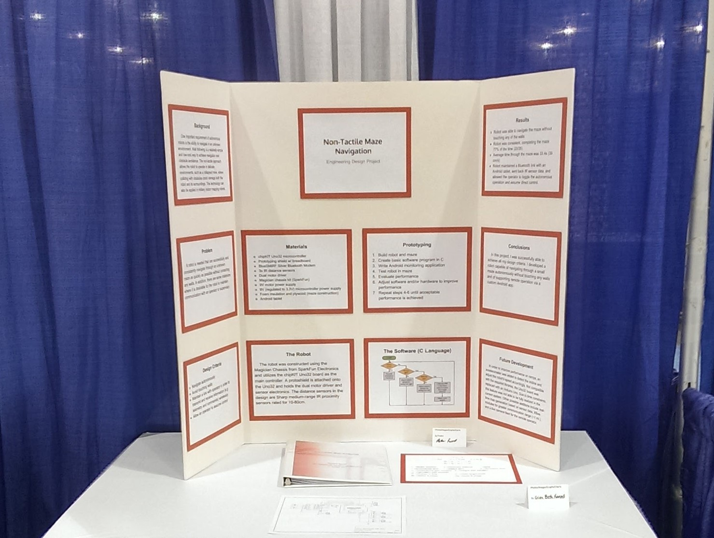
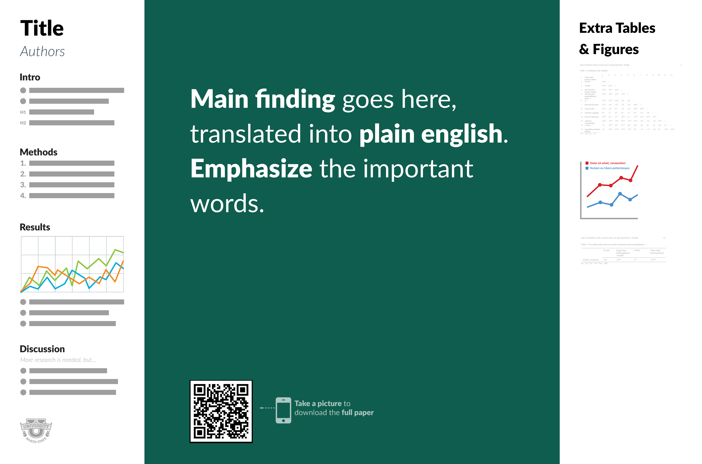

I could've titled this post "10 Can't Miss Tips for Blowing Away Your Science Fair Competition" but I'm not into clickbait titles and checklists. Plus that doesn't seem very sportsmanlike (or scientistlike? :thinking:). First, let's address the ethos question I know you're thinking...

## Why Should You Care What I Have to Say?
You don't have to listen to a thing I recommend. And you might win. Such is the nature of competitions that include subjective judging. However, these suggestions are motivated from really wanting to see students succeed at science and engineering, learn a rigorous process, and see how fun it can be. 

Beyond that, I won two overall state-level awards in middle school (yes, science fair is the only time you can cite middle school accomplishments) and a high school overall award in one of Kentucky's top two most competitive regions. Two of my three high school projects took me to the [International Science and Engineering Fair](https://www.societyforscience.org/isef/) (ISEF), and I placed in the grand awards my senior year. I was homeschooled (interpret that how you may), so I didn't just hop into a university lab with access to ridiculous equipment. I had help in the way of invaluable advice from college faculty and teachers, but that's transferable knowledge and precisely why I'm writing this article.

If you're thinking, "Yeah, but you're from Kentucky," realize that Kentucky delegations to ISEF place near the top every year in per capita awards. Look it up. We're not dumb :sunglasses:. So let's dive into it.

<em>My junior-year project at ISEF 2013 in Phoenix</em>

## But First, What *Is* Science?
Okay, quick timeout. Let's quickly review the science and engineering project processes. Your project absolutely must follow one of these two approaches. Sorry, no volcano demonstrations and solar system models allowed. You have to *test something*.

### The Scientific Method
The scientific method is simple. Ask a question, propose a hypothesis, design an experiment to check it, collect ~~some~~ a lot of data, analyze the results, evaluate your original hypothesis, and conclude by relating your results back to the broader question at hand. Boom. Science. :microscope:

### The Engineering Design Process
Less teachers and students are familiar with the engineering design process, but for most fairs, this is an equally valid project. Know your fair's rules, especially if judges complain that you didn't use the scientific method. Kindly remind them that you are doing an engineering project that has its own established methodology. 

The engineering process identifies a problem or need, defines design criteria that bounds the solution space, proposes multiple solutions, quantitatively evaluates their effectiveness, iteratively refines the best solutions until the design criteria are met, and concludes by relating the solution back to the broader problem. Bonus points if you can come up with numerical methods to establish your solution as optimal with respect to time, cost, and performance.

Okay, *now* we're ready.

## Solve a real problem (or ask a real question)
Please don't do a behavioral science experiment. Don't do subjective personal opinion studies or product research. Don't ask your family which popcorn tastes better. It's not that these projects can't be scientific (although I'd stay away from popcorn), it's that as a middle or high school student, it's nearly impossible for you to access large and diverse enough sample sizes to produce meaningful results. Sorry, but which toothbrush seems to work best on your twelve buddies from choir isn't going to cut it.

But, how are you, a 14-year-old, supposed to solve a real problem? Don't be intimidated. The key is finding a real, relevant problem and then reducing it to a simple problem that you can solve. Then, clearly show how your tiny bit of work is actually important in the grand scheme of things. Do you know of something cool Tesla is working on? Or something NASA might like to do? Great! Now distill that down to the core issue and build your project around that. No one expects you to be a child prodigy.

Take my junior year project as an example. I like robots that move. I like robots that can drive around by themselves. Who cares about that? Turns out, a lot of people. This was right around the time of the BP oil spill, and response teams were using partially autonomous underwater robots to inspect and repair the damage. So clearly, I'm not going to build a semiautonomous ROV, but I absolutely *can* build a maze navigation robot that is smart enough to ask a human robot to take over control when it gets stuck. If the robot spins around and doesn't find a way out, it tells a human over Bluetooth, streaming back sensor data, and enabling remote control until the operator manually returns control back to the robot. I used about $50 worth of parts (excluding an Android tablet) and a foamboard maze designed for another competition, but I was able to argue the importance of my project because I had to consider the same issues at play in semiautonomous systems from military unmanned ground vehicles to underwater ROVs along with the broader goal of assisting human operators.

My senior year I noticed that when NASA sends things to Mars it actually doesn't know where it's going to land due to atmospheric variance and other factors. Instead, NASA uses a landing ellipse to figure where the rover is most likely to end up. That seemed a bit weak, so I started brainstorming how to fix it. My idea was to install a minimal GPS around Mars. To prove the feasibility, I used simulations to figure out how many satellites would be needed in what orbits and how much fuel would be needed to get to Mars, researched atomic clocks that could fit in small satellites, developed concepts for how to insert the satellites into the necessary positions, and favorably compared a cost estimate with a similar idea from Georgia Tech. Let me emphasize something: *I did not physically build a single thing for this project. Nothing.* I won my Kentucky region (across all science and engineering projects) and placed at the international level. I was solving a real problem in a new way.

Oh, and whether you think it's fair or not, hot button issues (read: sustainability and climate change) will get an automatic bump. As a seventh grader, I experimented with blade designs on a model vertical axis wind turbine to figure out which produced the most voltage. I wasn't exactly enamoured with wind turbines, but the design aspect was interesting, and the judges loved it. From the second or third competition level and up, your judges will often be university faculty. Know your audience. Doing one of these projects may get you far enough to network and receive very valuable feedback. Once you get that advice, you can apply it in a field that may be more in your wheelhouse.

## Keep a laboratory notebook and write a research paper
Telling the judges you slaved over this project for months doesn't quite have the (literal) weight of handwritten memo books and a binder of background research, data, and conclusions. Nothing replaces that. Having a notebook with dated entries proves the time you spent and records your methodology and refinements. Take notes of all your ideas, what resources you consulted, what issues you ran into, how you fixed them, when and how you collected data, and anything else that seems relevant. Anything.

A research paper shows a huge level of committment and knowledge about the subject. A fifteen-page document with ten references (minimum) provides the foundational justification for your work, details your procedure, and makes the case for the importance of your results. It sounds like a lot, but once you realize that the paper should cover *everything* from background to experimental setup to procedure to raw data tables and plots to results analysis and discussion to conclusions and explanations of future work the pages stack up fast. Sure, the judges won't read it while you're giving your presentation, but at higher levels, they often review boards and materials the morning of the competition before you even show up. Give them something to do. Write a research paper. Show how much time you spent on this thing.

Speaking of time...

## You should spend months on this
Seriously. You have a full calendar year. Use it. Nobody won college scholarships with a project they did last weekend. There's two sides to this. First, your project better be complex enough to warrant six or more months of consistent work. You might spend a month or two simply doing in-depth background research. You shouldn't be able to collect all your data in an afternoon. Or two afternoons. Second, you better be interested in this topic because it will be staring you in the face for the next year.

I checked today, and my first literature review for my senior project is dated May 24th, 2013, for a competition season that started in mid-January of 2014. For those of you keeping track, that is less than a week after I returned from the 2013 ISEF competition, seven full months before I presented for any judges and an entire year before ISEF 2014.

Do the work. There are no shortcuts.

## Collect data -- numbers, and a lot of them
You absolutely must *must* MUST collect NUMERICAL DATA. Numbers. Preferably lots of them. Your data collection runs and experiments should include *no less than three trials*. Five or more is best. Each trial should be setup and run exactly the same way. Without this data, no one will believe that what you did was significant. As a side note, be *very* careful about ever claiming anything was *better* or *best* unless you have very clearly defined precisely what you mean by *better* or *best*. Not everyone may agree with the definition you assume is obvious.

So what should you be collecting numbers for? Your dependent variables. As a quick recap, *independent variables* are the values you are changing in your experiment to find optimal values for (make sure you note the values you used in all your trials), *dependent variables* are the outputs you are measuring, and *constants* are the values you are holding constant throughout all your experiments to prevent them from affecting the results in unexpected ways. The idea is to isolate the independent variables as the only things changing so you can directly measure how they impact the dependent variables. If you experiment to find what food ants prefer (please don't) based on how many visit the particular food in an hour, you need to control environmental factors. You shouldn't test one food on a sunny day and another in the freezing cold, at night, or in the rain. Those external factors will skew your data.

Engineering projects don't quite follow the same pattern, but rather need some numerical measurements to quantify *how good or optimal* the solution is and to prove it satisfies the design criteria (which should also be numerically defined). Independent variables still exist as parameters you can tweak on the solution. For example, in my GPS project, the parameters included the number of satellites and their orbits. The outputs came from my Python simulation that calculated how much surface coverage the satellite network achieved. Numbers for engineering projects can also include detailed cost estimates, power output, breaking force, torque output, software speed, and whatever else your solution can be measured by.

Not all numbers are created equal. Just because you can measure something does not mean that it is the right thing to measure. You must be able to use that data to strongly argue for whatever you think the experiment was showing. Don't try to use the time it took for your robot to finish the maze to prove that the obstacle avoidance system is working. Don't use the power generated by a solar panel in your living room to prove that the same configuration is perfect for reclaiming power from the roof of a car (sunlight is very different than flourescent bulbs).

## Please please please design a nice display board
This is a bit of a pet peeve of mine, but please -- *please* -- don't think you can slap some tiny text and graphs on a trifold and wow the judges, even if it follows the normal sequence of panels. Not gonna happen. It probably won't fly with most, but I personally like [this idea](https://www.npr.org/sections/health-shots/2019/06/11/729314248/to-save-the-science-poster-researchers-want-to-kill-it-and-start-over) from Mike Morrison at Michigan State University:

A more reasonable board might be the one I used for my Mars project, which you can check out [here](board_r3.pdf). Another example of a slightly different poster is one from my [senior design project](ENGR482_Poster_Team_01_Spring2018_Rev2.pdf). I don't claim that either of these posters is perfect or the best presentation of the information, but it might be starting point if you are completely stuck. If you want to avoid the classic trifold, explore making a 36" by 48" poster at a print shop. It can be expensive, so make sure you proof read the whole thing carefully!

Of course, the best board in the world won't help if you don't...

## Practice your presentation
If you can't communicate how awesome your project is, the judges won't know. So what makes a good presentation? Be concise. If you can't communicate what you did within about five or eight minutes, they won't have time to ask questions. Don't use overly technical jargon. Most of your judges won't be in your field . . . making *you* the expert on *your* project. So be confident. If you did the work, you'll have the answers. And if not, or in the off-chance that your judge *is* in your field, take note of their feedback. If a judge has technical questions and suggestions, it means they understood you. That's good. You might've won, and their feedback might reveal critical ways to bolster your project before the next competition. Finally, be enthusiastic! You worked for months on this. Someone actually wants to hear all about your effort and passion for solving this problem or discovering something new! Judges love to see that energy.

## Conclusion
Well, that's about all I can think of for now. Probably good since it was getting a little long. To recap:
- Choose a real problem or question that interests you
- Start early and be prepared to spend months on this
- Keep a lab notebook and write a research report with extensive background information
- Collect relevant data with enough trials while controlling for external factors
- Design your board to effectively communicate and catch the judges' eyes
- Practice practice practice your presentation before every level of competition

It might seem like a lot, but you can absolutely do this. Never be afraid to reach out for help and feedback. Do you know a scientist or engineer? Look up contact info for anyone who might be able to help, even if you don't know them. They can only say no. I emailed a PhD student and someone at NASA. I got responses from both and was able to meet with the PhD student in person for feedback. Run your ideas by them to see if they have suggestions. That's part of your background research! 

Science and engineering fairs can be extremely rewarding and prepare you immensely for research or industry in any science or engineering field. Even if you don't plan on staying in STEM, science develops critical thinking skills and a logical approach to problem solving and discovery -- valuable in any career (yes, including professional sports). Plus the short-term gain could be a couple hundred bucks in prize money or a college scholarship. So . . . it's January -- not too early to be bouncing around ideas for next year's round of competitions.

Want feedback on an idea? Send me an email with the link in my bio!

<em>Hanging out at Universal Studios in LA as part of ISEF 2014</em>
