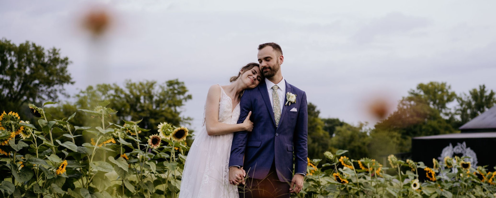

I'm finishing up my PhD degree (expected May 2023) at the University of Kentucky researching deep learning for monitoring the condition of machines on a factory floor. 

Outside of work, I recently got engaged (!) to Emma. I help lead a small group at my church. I'm also picking up a little Persian/Farsi using Pimsleur. It would be cool to be conversational in a few languages (a polyglot!), but I don't know if that's realistic. I used to do more music production but haven't done much in the last six months or so.

Some books I'd recommend right now are *Delighting in the Trinity* by Michael Reeves, *Strangely Bright* by Joe Rigney, *Range* by David Epstein, and *Soundtracks* by Jon Acuff.

In August 2022 I visited Mexico City for the CASE2022 conference, and then in October 2022 I visited Arches, Canyonlands, Capitol Reef, Bryce Canyon, and Zion National Parks with my family. In the past few years I've also visited Kenya and the Middle East.

Everyone has a favorite kind of math, and mine is probabilistic modeling.